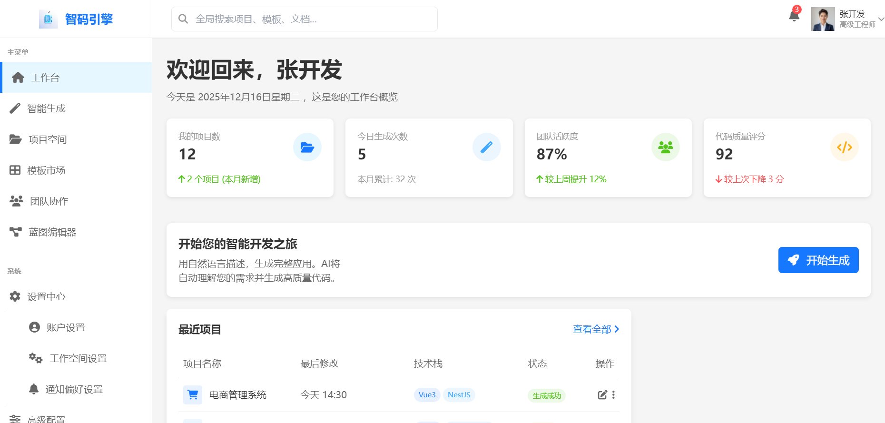
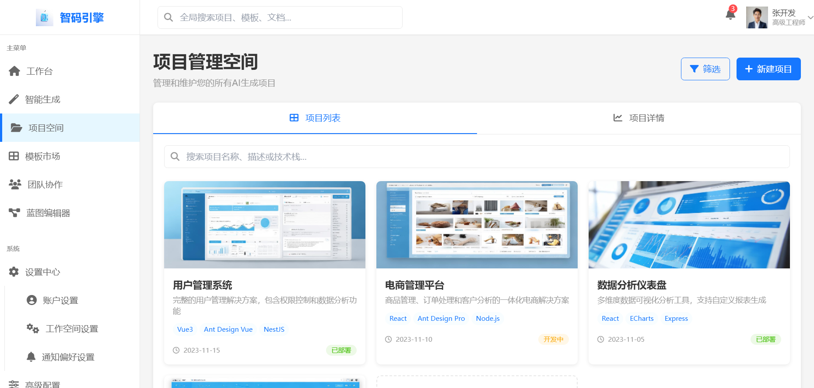
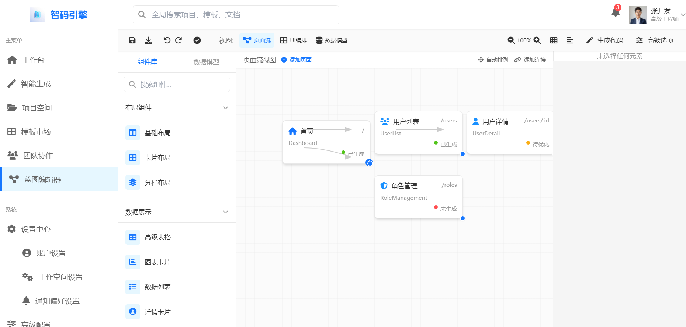
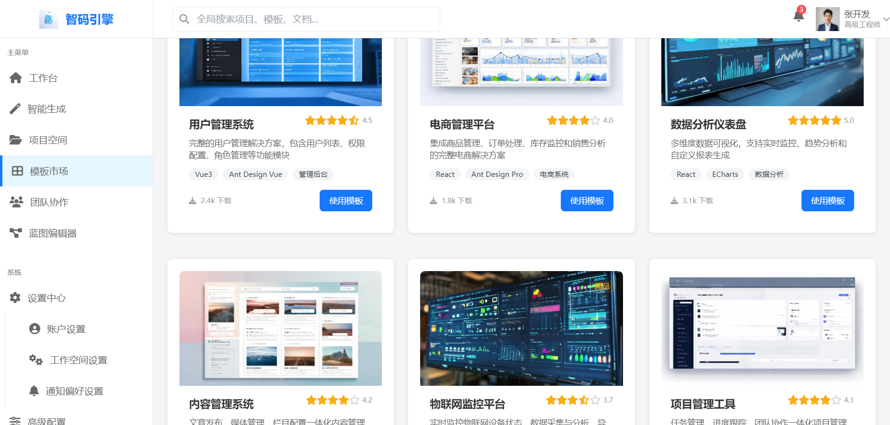
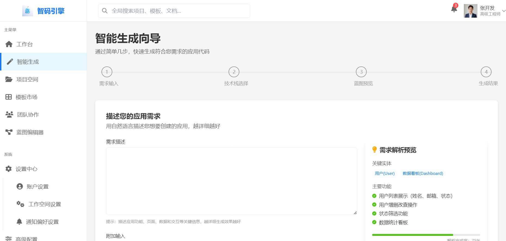
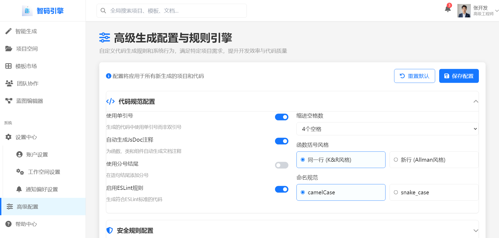
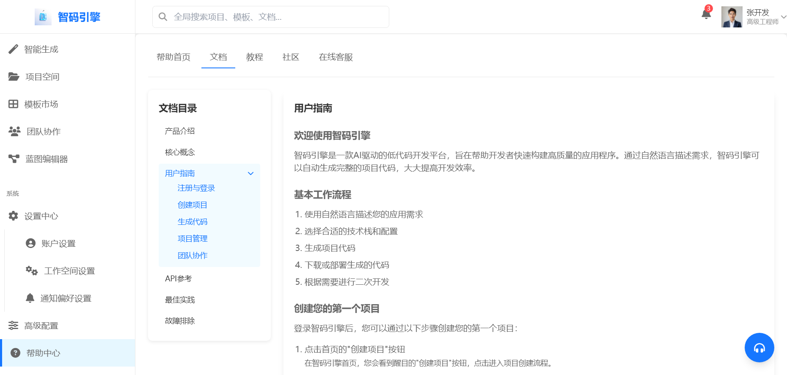

<p align="center">
	
</p>
<h1 align="center" style="margin: 30px 0 30px; font-weight: bold;">智码引擎 v1.0</h1>
<h4 align="center">基于RuoYi-Vue3-FastAPI的AI驱动低代码开发平台</h4>
<p align="center">
	<a href="https://gitee.com/insistence2022/RuoYi-Vue3-FastAPI/stargazers"></a>
    <a href="https://github.com/insistence/RuoYi-Vue3-FastAPI"></a>
	<a href="https://gitee.com/insistence2022/RuoYi-Vue3-FastAPI"></a>
	<a href="https://gitee.com/insistence2022/RuoYi-Vue3-FastAPI/blob/master/LICENSE"></a>
    
    
    
    
</p>

<p align="center">
    
    
</p>
<p align="center">
    
    
</p>
<p align="center">
    
    
</p>
<p align="center">
    
</p>

## 平台简介

**智码引擎**是基于RuoYi-Vue3-FastAPI框架进行二次开发的AI驱动低代码开发平台，其终极愿景是成为**软件开发的“编译器”**，将高级的人类意图（自然语言、草图、结构化描述）直接编译成高质量、可维护、全栈可运行的企业级应用。

### 开发规范
- 项目基于 [RuoYi-Vue3-FastAPI](https://gitee.com/insistence2022/RuoYi-Vue3-FastAPI) 脚手架开发，保持与原项目的架构一致性和技术栈兼容性。

智码引擎的核心工程挑战是调和一对固有矛盾：**大语言模型所代表的“创造性、灵活性但非确定性”** 与 **工业生产所要求的“可靠性、一致性、确定性”**。其破局之道是通过独创的**“分层约束引导式生成”架构**，有机融合大语言模型的创造性理解能力与传统低代码平台的工程化确定性，实现从自然语言描述到高质量、全栈可运行企业级应用代码的自动转换。

传统解决方案在此矛盾前纷纷折衷：低代码平台牺牲灵活性换取确定性；纯LLM助手则因不确定性而无法独立承担生产责任。智码引擎的创新在于建立了完整的“分层约束引导式生成架构”，通过统一应用元模型（UAM）作为中间层，将不确定的智能探索与确定的工程实践清晰分离又紧密连接，成功实现了二者的和谐统一。

### 核心价值
- **AI驱动开发**：将自然语言/草图/PRD转换为结构化应用蓝图，再生成可运行的全栈源代码，实现从想法到产品的超高速通道
- **分层约束架构**：独创"智能解析与规划→确定性代码生成→质量保障与装配"三层流水线，为LLM的创造力套上确定性的"轨道"和"质检线"，实现可控的智能爆发
- **统一应用元模型**：定义连接需求与代码的中间表示，确保系统各部分无缝协作，是实现跨技术栈生成的基础
- **质量内建**：将代码规范、安全模式、性能最佳实践直接编码到生成过程中，确保生成代码天生合规
- **人机协同**：定位为"AI协架构师"，系统生成重复性、模式化的骨架代码，开发者专注于独特业务逻辑和创意，从"砖瓦匠"升级为"蓝图设计师和精装工程师"
- **开放可演进**：核心架构与具体技术栈解耦，通过插件化设计支持技术栈横向扩展，为未来生态繁荣打下基础
- **资产自有权**：生成的是标准、可读、可修改的源代码，企业完全掌握知识产权和技术栈自主权
- **生态赋能**：通过模板市场和开放平台，降低软件构建成本，激发长尾需求，推动数字化转型

### 技术栈基础

#### 前端技术
* 框架：Vue3、TypeScript、Vite（基于RuoYi-Vue3前端项目修改）
* UI库：Element Plus
* 状态管理：Pinia
* 可视化编辑器：Monaco Editor（JSON编辑）、Leva/Tweakpane（参数化控制）
* API调用：Axios + 自动生成的TypeScript接口

#### 后端技术
* 框架：FastAPI、SQLAlchemy、Pydantic
* 数据库：MySQL（≥5.7）、PostgreSQL（支持）
* 缓存：Redis
* 认证授权：OAuth2 & JWT
* API文档：Swagger/OpenAPI 3.0

#### AI服务技术
* 语言：Python（AI服务）、Go（核心服务）
* LLM集成：OpenAI GPT、Anthropic Claude、国内大模型（多供应商策略，降险并优化成本）
* 框架：LangChain/LlamaIndex（智能规划服务）
* 提示工程：专用提示词模板、少样本示例、思维链（CoT）技术

#### 基础设施
* 容器化：Docker
* 编排：Kubernetes
* 服务网格：Istio（高级流量管理、安全策略）
* CI/CD：GitLab CI、ArgoCD（GitOps）
* 监控：Prometheus（指标）、Grafana（可视化）、Loki（日志）、Tempo（链路追踪）
* 消息队列：Kafka（事件驱动架构）
* 对象存储：S3/OSS（生成产物存储）

#### 核心功能技术
* 代码生成：模板引擎（Jinja2/Handlebars）、插件化生成引擎
* 质量保障：ESLint、Prettier、TypeScript、Jest/Vitest、SonarJS
* 事件驱动：Kafka事件总线
* 模板系统：基于抽象语法树（AST）的模板，支持智能代码结构处理
* 蓝图验证：JSON Schema验证、语义验证、冲突消解

* 支持动态权限菜单，多方式轻松权限控制
* 支持多终端认证系统

### 历史版本
* Vue2版本：
  - Gitte仓库地址：https://gitee.com/insistence2022/RuoYi-Vue-FastAPI
  - GitHub仓库地址：https://github.com/insistence/RuoYi-Vue-FastAPI
* 纯Python版本：
  - Gitte仓库地址：https://gitee.com/insistence2022/dash-fastapi-admin
  - GitHub仓库地址：https://github.com/insistence/Dash-FastAPI-Admin

### 特别鸣谢
* <u>[RuoYi-Vue3](https://github.com/yangzongzhuan/RuoYi-Vue3)</u>
* <u>[RuoYi-Vue3-FastAPI](https://gitee.com/insistence2022/RuoYi-Vue3-FastAPI)</u>：本项目基于此脚手架进行二次开发
* 参与项目的所有贡献者

## 内置功能

### 一、AI驱动核心功能
1.  **智能需求解析**：通过多模态解析和LLM交互，将自然语言/草图/PRD转换为结构化的应用蓝图
2.  **应用蓝图管理**：统一应用元模型的可视化编辑、版本控制、差异对比和回滚
3.  **三层约束代码生成**：通过插件化引擎将蓝图转换为高质量、可运行的前后端代码
4.  **质量保障流水线**：自动化代码质量检查，包括格式化、静态分析、契约验证、测试生成和构建测试
5.  **模板市场**：支持自定义模板上传、分享、评级与使用，扩展多技术栈支持
6.  **智能规划服务**：基于LLM的需求增强、架构选择与蓝图构建，确保多轮对话的一致性
7.  **代码预览与协同**：生成结果预览、代码评审和团队协作功能
8.  **领域模型复用**：通用模块（如权限管理）可定义为独立子蓝图，支持跨项目复用

### 二、基础管理功能
1.  **用户管理**：用户是系统操作者，该功能主要完成系统用户配置。
2.  **角色管理**：角色菜单权限分配、设置角色按机构进行数据范围权限划分。
3.  **菜单管理**：配置系统菜单，操作权限，按钮权限标识等。
4.  **部门管理**：配置系统组织机构（公司、部门、小组）。
5.  **岗位管理**：配置系统用户所属担任职务。
6.  **字典管理**：对系统中经常使用的一些较为固定的数据进行维护。
7.  **参数管理**：对系统动态配置常用参数。
8.  **通知公告**：系统通知公告信息发布维护。
9.  **操作日志**：系统正常操作日志记录和查询；系统异常信息日志记录和查询。
10.  **登录日志**：系统登录日志记录查询包含登录异常。
11.  **在线用户**：当前系统中活跃用户状态监控。
12.  **定时任务**：在线（添加、修改、删除）任务调度包含执行结果日志。
13.  **服务监控**：监视当前系统CPU、内存、磁盘、堆栈等相关信息。
14.  **缓存监控**：对系统的缓存信息查询，命令统计等。
15.  **在线构建器**：拖动表单元素生成相应的HTML代码。
16.  **系统接口**：根据业务代码自动生成相关的api接口文档。
17.  **代码生成**：配置数据库表信息一键生成前后端代码（python、sql、vue、js），支持下载。

## 核心架构

### 整体架构全景
智码引擎采用分层架构设计，从下到上分为五大层次，每层职责明确，相互协作形成完整的AI驱动低代码开发平台。

```
┌─────────────────────────────────────────────────────────────────────────────────────────────┐
│                                **交互与协作层 (Interaction & Collaboration Layer)**          │
│  Web工作台 / CLI / IDE插件 / 开放API                                                         │
│  - 自然语言需求输入 - 蓝图可视化编辑器 - 团队项目管理 - 生成结果预览与协同评审               │
├─────────────────────────────────────────────────────────────────────────────────────────────┤
│                              **核心服务平台层 (Core Service Platform Layer)**                │
│  ┌─────────────────┐ ┌─────────────────┐ ┌─────────────────┐ ┌─────────────────┐          │
│  │  智能规划服务   │ │  代码生成服务   │ │  质量保障服务   │ │  资产与生态服务 │          │
│  │ (Orchestrator)  │ │ (Code Factory)  │ │  (QA Pipeline)  │ │  (Asset Hub)    │          │
│  └─────────────────┘ └─────────────────┘ └─────────────────┘ └─────────────────┘          │
├─────────────────────────────────────────────────────────────────────────────────────────────┤
│                              **统一应用元模型层 (Unified Application Meta-Model Layer)**      │
│  ┌─────────────────────────────────────────────────────────────────────────────────────┐    │
│  │                    **应用蓝图 (Application Blueprint)**                              │    │
│  │  - 数据模型 (Data Models) - 接口契约 (API Contracts) - 用户界面 (UI Schema)         │    │
│  │  - 业务逻辑流 (Logic Flows) - 部署配置 (Deployment Spec) - 项目元信息 (Metadata)     │    │
│  └─────────────────────────────────────────────────────────────────────────────────────┘    │
├─────────────────────────────────────────────────────────────────────────────────────────────┤
│                        **领域模型与持久化层 (Domain Model & Persistence Layer)**            │
│  ┌─────────────┐ ┌─────────────┐ ┌─────────────┐ ┌─────────────┐                          │
│  │  项目       │ │  蓝图       │ │  模板       │ │  用户       │                          │
│  │  (Project)  │ │  (Blueprint)│ │  (Template) │ │  (User)     │                          │
│  └─────────────┘ └─────────────┘ └─────────────┘ └─────────────┘                          │
├─────────────────────────────────────────────────────────────────────────────────────────────┤
│                              **基础设施与运维层 (Infrastructure & DevOps Layer)**            │
│  容器编排 (K8s) │ 服务网格 (Istio) │ API网关 │ 监控/日志/追踪 │ 对象存储 │ 消息队列 (Kafka) │
└─────────────────────────────────────────────────────────────────────────────────────────────┘
```

### 统一应用元模型（UAM）：六大支柱
UAM是智码引擎的基石，定义了连接需求与代码的中间表示，由六个核心部分构成：

1.  **数据模型 (Data Models)**：定义应用管理的核心业务实体及其关系，支持基础类型、业务语义类型和实体关系
2.  **接口契约 (API Contracts)**：以OpenAPI 3.0风格定义RESTful API端点，是前后端协同的唯一真理源
3.  **用户界面模式 (UI Schema)**：声明式描述UI结构、组件、布局和交互，完全独立于具体UI库
4.  **业务逻辑流 (Logic Flows)**：描述复杂业务过程，支持可视化编排和跨实体的状态管理
5.  **部署配置 (Deployment Spec)**：定义应用运行所需的环境、资源和部署方式
6.  **项目元信息 (Metadata)**：包含项目标识、版本、团队、生成历史等管理信息

### 核心服务平台：四大微服务
UAM是静态的"图纸"，核心服务则是动态的"工厂流水线"，包括四个核心微服务：

1.  **智能规划服务 (Orchestrator)**：将非结构化用户输入转换为结构化的ApplicationBlueprint，与LLM交互的主战场
2.  **代码生成服务 (Code Factory)**：将验证后的蓝图翻译成特定技术栈的源代码，完全确定性的过程
3.  **质量保障服务 (QA Pipeline)**：对生成代码进行自动化质量检查，包括格式化、静态分析、测试生成等
4.  **资产与生态服务 (Asset Hub)**：管理生成过程中的一切资产，包括蓝图版本、模板、项目资产等

### 关键技术创新
1.  **三层约束引导式生成流水线**：智能解析与规划 → 确定性代码生成 → 质量保障与装配
2.  **统一应用元模型（UAM）**：定义连接需求与代码的中间表示，确保系统各部分无缝协作
3.  **插件化代码生成引擎**：支持多技术栈扩展，确保生成过程的确定性和高质量
4.  **LLM Orchestrator**：将非结构化需求转换为规范的应用蓝图，确保多轮对话的一致性
5.  **事件驱动架构**：通过Kafka实现服务间松耦合协作，确保系统弹性和可追溯性
6.  **质量内建机制**：将代码规范、安全模式、性能最佳实践直接编码到生成过程中

## 发展路线图

### 第一阶段：MVP打造与核心验证 (M1-M6)
**目标**：验证“分层生成”架构可行性，发布最小可行产品
- 完成统一应用元模型（UAM）V1.0设计，实现六大支柱的基础定义
- 实现智能规划服务（Orchestrator）基础功能，支持自然语言到蓝图的转换
- 开发Vue 3 + FastAPI的基础代码生成引擎，支持核心CRUD操作
- 构建基础Web工作台，包含蓝图编辑器和生成结果预览
- 实现基础质量保障流水线（代码格式化、基础静态分析）
- 邀请种子用户进行封闭测试，收集反馈并迭代优化
- 发布公测版，开放免费注册，验证产品市场契合度

### 第二阶段：产品化与商业化准备 (M7-M18)
**目标**：完善产品矩阵，建立商业化基础
- 扩展技术栈支持：增加React前端和Spring Boot后端的代码生成能力
- 增强UAM功能：支持更复杂的数据模型关系、接口契约和UI组件
- 实现完整的质量保障流水线：包含契约验证、测试生成、构建测试
- 开发团队协作功能：团队空间、项目模板共享、版本历史与回滚
- 完善资产与生态服务：搭建模板市场的基础框架
- 实现LLM多供应商策略：支持OpenAI、Anthropic和国内大模型
- 搭建计费与用户管理系统，准备商业化运营
- 发布正式版，启动商业化运营，服务中小企业客户

### 第三阶段：生态构建与规模增长 (M19-M36)
**目标**：从工具产品向平台生态演进
- 推出模板开发工具包（TDK），支持第三方开发者创建自定义模板
- 上线完整的模板市场，启动“创作者计划”，激励模板开发
- 与行业ISV合作，推出垂直领域解决方案包（如电商、教育、医疗）
- 增强企业级功能：单点登录、审计日志、合规性支持、高级安全特性
- 引入基于历史数据的强化学习，优化智能规划服务的生成质量
- 探索国际化版本，支持多语言界面和文档，拓展海外市场
- 构建开发者社区，提供API开放平台，支持系统集成与扩展

### 长期愿景：软件生产的“编译器” (M36+)
**目标**：成为软件开发的基础设施
- 实现更高级的多模态输入支持（语音、视频、3D模型）
- 支持更复杂的业务逻辑自动生成，减少人工干预
- 建立软件资产库，实现跨项目的组件、模型和流程复用
- 成为企业级软件数字资产的设计、管理和生成中心
- 推动软件开发范式从“编写代码”向“描述需求”转变

## 演示图

<table>
    <tr>
        <td></td>
        <td></td>
    </tr>
    <tr>
        <td></td>
        <td></td>
    </tr>
    <tr>
        <td></td>
        <td></td>
    </tr>
    <tr>
        <td></td>
        <td></td>
    </tr>	 
    <tr>
        <td></td>
        <td></td>
    </tr>
    <tr>
        <td></td>
        <td></td>
    </tr>
    <tr>
        <td></td>
        <td></td>
    </tr>
    <tr>
        <td></td>
        <td></td>
    </tr>
    <tr>
        <td></td>
        <td></td>
    </tr>
    <tr>
        <td></td>
        <td></td>
    </tr>
    <tr>
        <td></td>
    </tr>
</table>

## 在线体验
- *账号：admin*
- *密码：admin123*
- 演示地址：<a href="https://vfadmin.insistence.tech">vfadmin管理系统<a>

## 项目开发及发布相关

### 开发

conda activate memory-palace

python app.py --env=prod

```bash
# 克隆项目
git clone https://gitee.com/insistence2022/RuoYi-Vue3-FastAPI.git

# 进入项目根目录
cd RuoYi-Vue3-FastAPI
```

#### 前端
```bash
# 进入前端目录
cd ruoyi-fastapi-frontend

# 安装依赖
npm install 或 yarn --registry=https://registry.npmmirror.com

# 建议不要直接使用 cnpm 安装依赖，会有各种诡异的 bug。可以通过如下操作解决 npm 下载速度慢的问题
npm install --registry=https://registry.npmmirror.com

# 启动服务
npm run dev 或 yarn dev
```

#### 后端
```bash
# 进入后端目录
cd ruoyi-fastapi-backend

# 如果使用的是MySQL数据库，请执行以下命令安装项目依赖环境
pip3 install -r requirements.txt
# 如果使用的是PostgreSQL数据库，请执行以下命令安装项目依赖环境
pip3 install -r requirements-pg.txt

# 配置环境
在.env.dev文件中配置开发环境的数据库和redis

# 运行sql文件
1.新建数据库ruoyi-fastapi(默认，可修改)
2.如果使用的是MySQL数据库，使用命令或数据库连接工具运行sql文件夹下的ruoyi-fastapi.sql；如果使用的是PostgreSQL数据库，使用命令或数据库连接工具运行sql文件夹下的ruoyi-fastapi-pg.sql

# 运行后端
python3 app.py --env=dev
```

#### 访问
```bash
# 默认账号密码
账号：admin
密码：admin123

# 浏览器访问
地址：http://localhost:80
```

### 发布

#### 前端
```bash
# 构建测试环境
npm run build:stage 或 yarn build:stage

# 构建生产环境
npm run build:prod 或 yarn build:prod
```

#### 后端
```bash
# 配置环境
在.env.prod文件中配置生产环境的数据库和redis

# 运行后端
python3 app.py --env=prod
```

