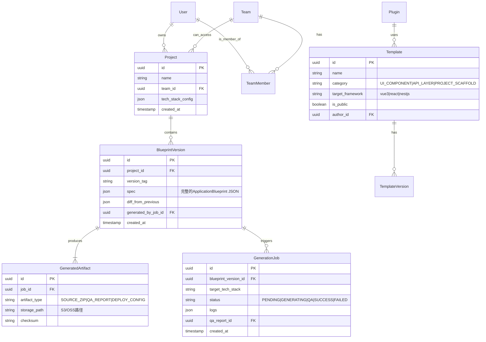

# **“智码引擎”AI驱动低代码开发平台：核心架构设计白皮书**

## **第一部分：战略架构总览与设计哲学**

### **1.1 项目愿景与核心挑战**

**智码引擎**的终极愿景是成为**软件开发的“编译器”**，将高级的人类意图（自然语言、草图、结构化描述）直接编译成高质量、可维护、全栈可运行的企业级应用。其面临的核心工程挑战是调和一对固有矛盾：**大语言模型所代表的“创造性、灵活性但非确定性”** 与 **工业生产所要求的“可靠性、一致性、确定性”**。

传统解决方案在此矛盾前纷纷折衷：低代码平台牺牲灵活性换取确定性；纯LLM助手则因不确定性而无法独立承担生产责任。智码引擎的破局之道，不是二选一，而是通过精密的架构设计，**为LLM的创造力套上确定性的“轨道”和“质检线”**，从而实现“可控的智能爆发”。

### **1.2 核心设计哲学**

1.  **分层约束与关注点分离**：将“理解世界”（需求解析）与“改造世界”（代码生成）解耦。LLM专注于前者，在严格的输出规范约束下工作；确定性引擎则专注于后者，将结构化的“蓝图”无差错地转化为代码。
2.  **统一应用元模型（Unified Application Meta-Model, UAM）**：定义一套连接需求与代码的**中间表示**。这是整个系统的“世界语”，是LLM的输出目标，也是生成引擎的输入规范。它必须足够丰富以描述复杂应用，又足够规范以供机器无歧义解析。
3.  **质量内建，而非事后检验**：将代码规范、安全模式、性能最佳实践直接编码到生成模板和流水线规则中，确保生成的每一行代码都“天生合规”。质量检查是生成过程不可跳过的环节。
4.  **人机协同，而非完全替代**：定位为“AI协架构师”。系统负责生成重复性、模式化的“骨架”代码，并为开发者预留清晰、友好的“插入点”，以填充独特的业务逻辑和创意。开发者的角色从“砖瓦匠”升级为“蓝图设计师和精装工程师”。
5.  **开放与可演进**：核心架构与具体的前端框架、后端语言、UI库解耦。通过插件化设计，支持技术栈的横向扩展和模板生态的繁荣。

### **1.3 整体架构全景图**

智码引擎是一个复杂的软件生产系统，其架构遵循“输入-处理-输出”的经典范式，但在“处理”层进行了革命性设计。

```
┌─────────────────────────────────────────────────────────────────────────────────────────────┐
│                                **交互与协作层 (Interaction & Collaboration Layer)**          │
│  Web工作台 / CLI / IDE插件 / 开放API                                                         │
│  - 自然语言需求输入 - 蓝图可视化编辑器 - 团队项目管理 - 生成结果预览与协同评审               │
├─────────────────────────────────────────────────────────────────────────────────────────────┤
│                              **核心服务平台层 (Core Service Platform Layer)**                │
│  ┌─────────────────┐ ┌─────────────────┐ ┌─────────────────┐ ┌─────────────────┐          │
│  │  智能规划服务   │ │  代码生成服务   │ │  质量保障服务   │ │  资产与生态服务 │          │
│  │ (Orchestrator)  │ │ (Code Factory)  │ │  (QA Pipeline)  │ │  (Asset Hub)    │          │
│  └─────────────────┘ └─────────────────┘ └─────────────────┘ └─────────────────┘          │
├─────────────────────────────────────────────────────────────────────────────────────────────┤
│                              **统一应用元模型层 (Unified Application Meta-Model Layer)**      │
│  ┌─────────────────────────────────────────────────────────────────────────────────────┐    │
│  │                    **应用蓝图 (Application Blueprint)**                              │    │
│  │  - 数据模型 (Data Models) - 接口契约 (API Contracts) - 用户界面 (UI Schema)         │    │
│  │  - 业务逻辑流 (Logic Flows) - 部署配置 (Deployment Spec) - 项目元信息 (Metadata)     │    │
│  └─────────────────────────────────────────────────────────────────────────────────────┘    │
│                                          ▲                                                  │
│                                          │ (序列化/反序列化)                                 │
├─────────────────────────────────────────────────────────────────────────────────────────────┤
│                        **领域模型与持久化层 (Domain Model & Persistence Layer)**            │
│  ┌─────────────┐ ┌─────────────┐ ┌─────────────┐ ┌─────────────┐                          │
│  │  项目       │ │  蓝图       │ │  模板       │ │  用户       │                          │
│  │  (Project)  │ │  (Blueprint)│ │  (Template) │ │  (User)     │                          │
│  └─────────────┘ └─────────────┘ └─────────────┘ └─────────────┘                          │
├─────────────────────────────────────────────────────────────────────────────────────────────┤
│                              **基础设施与运维层 (Infrastructure & DevOps Layer)**            │
│  容器编排 (K8s) │ 服务网格 (Istio) │ API网关 │ 监控/日志/追踪 │ 对象存储 │ 消息队列 (Kafka) │
└─────────────────────────────────────────────────────────────────────────────────────────────┘
```

此架构自上而下，逐层抽象：
- **基础设施层**：提供弹性的、可观测的云原生底座。
- **领域与持久层**：管理核心业务实体及其生命周期。
- **统一应用元模型层**：系统的“心脏”，承载了从需求到代码的中间表示（蓝图）。
- **核心服务平台层**：系统的“大脑”和“四肢”，包含实现核心价值流的四大微服务。
- **交互与协作层**：系统的“五官”，提供多样化的用户界面和集成方式。

---

## **第二部分：统一应用元模型（UAM）深度设计**

UAM是智码引擎的基石。它不是一个单一的文件，而是一个由多个关联模式（Schema）组成的**语义网络**，共同完整定义一个可生成的应用程序。

### **2.1 UAM核心构成：六大支柱**

一个完整的`ApplicationBlueprint`由以下六个核心部分构成，它们相互引用，形成一个自洽的整体。

#### **支柱一：数据模型 (Data Models)**
定义应用程序管理的所有核心业务实体及其关系，是后端领域模型和前端TypeScript接口的源头。
```json
{
  "DataModels": {
    "User": {
      "description": "系统用户",
      "fields": {
        "id": { "type": "PrimaryKey", "dbType": "bigint", "autoIncrement": true },
        "username": { "type": "string", "maxLength": 50, "nullable": false, "unique": true },
        "email": { "type": "string", "format": "email", "nullable": false },
        "status": { "type": "enum", "values": ["ACTIVE", "INACTIVE", "SUSPENDED"], "default": "ACTIVE" },
        "createdAt": { "type": "datetime", "default": "NOW" }
      },
      "indexes": [{"fields": ["email"], "unique": true}],
      "relations": {
        "posts": { "type": "OneToMany", "target": "Post", "inverse": "author" }
      }
    },
    "Post": {
      "description": "用户发布的文章",
      "fields": { ... },
      "relations": {
        "author": { "type": "ManyToOne", "target": "User", "nullable": false }
      }
    }
  }
}
```
*   **关键点**：类型系统不仅包括基础类型（string, number），还包含业务语义类型（email, phone）。关系定义（OneToMany, ManyToOne）将直接驱动后端实体关联和前端数据查询的生成。

#### **支柱二：接口契约 (API Contracts)**
以OpenAPI 3.0为灵感，定义所有RESTful API端点。这是前后端协同的**唯一真理源**。
```json
{
  "APIContracts": {
    "paths": {
      "/api/users": {
        "GET": {
          "operationId": "getUserList",
          "summary": "分页查询用户列表",
          "parameters": [
            { "name": "page", "in": "query", "schema": { "type": "integer", "minimum": 1 } },
            { "name": "status", "in": "query", "schema": { "$ref": "#/DataModels/User/fields/status" } }
          ],
          "responses": {
            "200": {
              "description": "成功",
              "content": {
                "application/json": {
                  "schema": {
                    "type": "object",
                    "properties": {
                      "list": { "type": "array", "items": { "$ref": "#/DataModels/User" } },
                      "total": { "type": "integer" }
                    }
                  }
                }
              }
            }
          }
        },
        "POST": { ... }
      },
      "/api/users/{id}": {
        "GET": { ... },
        "PUT": { ... },
        "DELETE": { ... }
      }
    }
  }
}
```
*   **关键点**：参数和响应Schema可直接引用`DataModels`中的定义，保证一致性。`operationId`将用于生成前端调用的函数名和后端Controller的方法名。

#### **支柱三：用户界面模式 (UI Schema)**
以声明式方式描述用户界面的结构、组件、布局和交互，完全独立于具体UI库。
```json
{
  "UISchema": {
    "pages": [
      {
        "id": "userListPage",
        "name": "用户管理",
        "path": "/system/users",
        "layout": "AdminLayout",
        "components": [
          {
            "id": "userTable",
            "type": "DataTable",
            "dataBinding": {
              "operationId": "getUserList", // 引用 API Contracts
              "transform": "response => ({ data: response.list, total: response.total })"
            },
            "props": {
              "rowKey": "id",
              "columns": [
                { "dataIndex": "id", "title": "ID", "width": 80 },
                { 
                  "dataIndex": "username", 
                  "title": "用户名",
                  "renderType": "Link",
                  "linkTo": { "pageId": "userDetailPage", "params": { "id": "$record.id" } }
                },
                { "dataIndex": "status", "title": "状态", "renderType": "Tag" }
              ],
              "rowOperations": [
                { "type": "Edit", "icon": "EditOutlined", "action": "navigateToDetail" },
                { 
                  "type": "Delete", 
                  "icon": "DeleteOutlined", 
                  "action": "callApi",
                  "api": { "operationId": "deleteUser", "params": { "id": "$record.id" } },
                  "confirm": { "title": "确认删除？" }
                }
              ],
              "batchOperations": [
                { "type": "BatchDelete", "api": { "operationId": "batchDeleteUsers" } }
              ],
              "toolbar": [
                { "type": "CreateButton", "text": "新建用户", "action": "openModal:createUserForm" }
              ]
            }
          },
          {
            "id": "createUserForm",
            "type": "ModalForm",
            "title": "新建用户",
            "visibleBinding": "$uiState.modals.createUserFormVisible",
            "formConfig": {
              "fields": [
                { "dataIndex": "username", "label": "用户名", "component": "Input", "rules": [{ "required": true }] },
                { "dataIndex": "email", "label": "邮箱", "component": "Input", "rules": [{ "type": "email" }] }
              ],
              "submitApi": { "operationId": "createUser" }
            }
          }
        ]
      },
      {
        "id": "userDetailPage",
        "path": "/system/users/:id",
        "layout": "AdminLayout",
        "components": [ ... ]
      }
    ]
  }
}
```
*   **关键点**：
    1.  **组件抽象**：`DataTable`, `ModalForm`是平台定义的抽象组件类型，不与任何具体UI库绑定。
    2.  **数据绑定**：通过`operationId`直接绑定到`APIContracts`，建立UI与数据的强关联。
    3.  **交互声明**：`action`字段声明交互行为（导航、调用API、打开模态框），具体实现由生成引擎根据目标框架决定。
    4.  **表达式支持**：支持简单的表达式（如`$record.id`, `$uiState.modals.xxx`）实现动态逻辑。

#### **支柱四：业务逻辑流 (Logic Flows)**
描述不能简单归结为CRUD的、多步骤的、有状态或跨实体的业务过程。
```json
{
  "LogicFlows": {
    "userRegistration": {
      "description": "用户注册流程，包含发送验证邮件",
      "trigger": { "type": "api", "operationId": "registerUser" },
      "steps": [
        {
          "id": "validateInput",
          "type": "Validation",
          "rules": [ ... ]
        },
        {
          "id": "createUserRecord",
          "type": "DatabaseOperation",
          "entity": "User",
          "action": "create",
          "inputMapping": { "from": "$trigger.payload", "to": "$step.output" }
        },
        {
          "id": "sendWelcomeEmail",
          "type": "ExternalService",
          "service": "EmailService",
          "operation": "sendTemplate",
          "parameters": {
            "to": "$steps.createUserRecord.output.email",
            "templateId": "welcome_v1"
          },
          "async": true // 异步执行，不阻塞主流程
        }
      ],
      "outputMapping": { "userId": "$steps.createUserRecord.output.id" }
    }
  }
}
```
*   **关键点**：为复杂业务逻辑提供可视化编排的基础。在生成时，简单的流可能被直接翻译为服务层代码，复杂的流可能生成工作流引擎（如Camunda）的配置或引导开发者手动实现。

#### **支柱五：部署配置 (Deployment Spec)**
定义应用运行所需的环境、资源和部署方式。
```json
{
  "DeploymentSpec": {
    "environments": ["development", "staging", "production"],
    "compute": {
      "frontend": { "type": "static", "runtime": "nginx" },
      "backend": { "type": "container", "runtime": "node:18", "replicas": 2 }
    },
    "datastore": {
      "primary": { "type": "PostgreSQL", "version": "14", "ha": true }
    },
    "dependencies": [
      { "name": "redis", "purpose": "caching", "type": "managed" }
    ]
  }
}
```

#### **支柱六：项目元信息 (Metadata)**
包含项目标识、版本、团队、生成历史等管理信息。
```json
{
  "Metadata": {
    "projectId": "proj_abc123",
    "name": "用户管理系统",
    "version": "1.0.0",
    "generatedBy": "智码引擎 v2.1",
    "techStack": { "frontend": "Vue3", "backend": "NestJS", "uiLibrary": "Ant Design Vue" },
    "createdAt": "2023-10-27T08:00:00Z",
    "lastModifiedAt": "2023-10-27T10:30:00Z"
  }
}
```

### **2.2 UAM的序列化与版本管理**

- **序列化格式**：采用**JSON**作为主要序列化格式，因其通用、可读、易于被LLM处理和生成。同时提供严格的**JSON Schema**定义用于验证。
- **版本控制**：`ApplicationBlueprint`本身是版本化的。每次生成或重大修改都创建一个新版本，支持蓝图的差异对比和回滚。
- **可组合性**：蓝图支持**导入(import)** 和**扩展(extends)**。通用模块（如“权限管理模块”）可以定义为独立的子蓝图，被多个主蓝图引用和复用。

---

## **第三部分：核心服务平台架构**

UAM是静态的“图纸”，核心服务则是动态的“工厂流水线”。我们将整个生成过程分解为四个核心微服务，每个服务职责单一，通过事件和API协同。

### **3.1 服务一：智能规划服务 (Orchestrator)**

**职责**：将非结构化的用户输入，转化为结构化的、有效的`ApplicationBlueprint`。这是与LLM交互的主战场。

#### **3.1.1 服务架构**
```
┌─────────────────────────────────────────────────────┐
│             智能规划服务 (Orchestrator)              │
├───────────────┬──────────────┬──────────────────────┤
│  输入适配层   │  规划引擎层   │  输出验证与优化层    │
│ - 多模态解析  │ - LLM 协调    │ - Schema 验证       │
│ - 需求增强    │ - 蓝图构建    │ - 蓝图优化          │
│ - 会话管理    │ - 决策树      │ - 冲突消解          │
└───────────────┴──────────────┴──────────────────────┘
                          │
                   异步消息 / RPC
                          │
          ┌───────────────┼───────────────┐
          ▼               ▼               ▼
    ┌──────────┐   ┌──────────┐   ┌──────────┐
    │ LLM 网关 │   │ 知识库   │   │ 规则库   │
    │ (多供应商)│   │ (案例/模式)│  │ (业务规则)│
    └──────────┘   └──────────┘   └──────────┘
```

#### **3.1.2 核心工作流**
1.  **输入解析与增强**：
    *   接受文本、草图、甚至语音输入。
    *   调用LLM对模糊需求进行**澄清式提问**（如：“您说的‘状态’具体指哪几种？”）或补全（补充默认的CRUD操作）。
    *   输出结构化的**需求清单**。

2.  **多轮蓝图构建**：这是一个迭代过程，模拟资深架构师的思考。
    *   **第一轮：确定数据模型**。基于需求清单，引导LLM识别核心实体（如User, Product, Order）及其字段和关系。生成并验证`DataModels`部分。
    *   **第二轮：设计API契约**。基于数据模型，为每个实体生成标准的CRUD API，并识别特殊业务接口。生成并验证`APIContracts`部分。
    *   **第三轮：规划用户界面**。基于数据模型和API，规划主要页面、布局和核心组件。生成`UISchema`的初稿。
    *   **第四轮：补充逻辑与配置**。识别需要`LogicFlows`的复杂过程，并补充`DeploymentSpec`和`Metadata`。

3.  **验证、优化与冲突消解**：
    *   **语法验证**：使用JSON Schema确保蓝图格式正确。
    *   **语义验证**：检查跨支柱的引用一致性（如UI中引用的API是否存在）。
    *   **优化**：应用规则进行优化（如将常用的筛选字段自动添加到查询API的参数中）。
    *   **冲突消解**：当需求间存在矛盾时（如一个字段在A处只读，在B处可编辑），记录冲突点，或根据优先级规则自动消解，或生成问题列表请求用户确认。

#### **3.1.3 LLM集成策略**
- **提示工程**：为蓝图构建的每一轮设计专用的、包含少样本示例的提示词模板。
- **多供应商降险**：同时接入OpenAI GPT-4、Anthropic Claude、国内大模型等，根据任务类型和成本选择，或并行生成并选择最优结果。
- **上下文管理**：为每个生成会话维护一个“上下文窗口”，包含历史决策，确保多轮对话的一致性。

### **3.2 服务二：代码生成服务 (Code Factory)**

**职责**：将经过验证的`ApplicationBlueprint`，翻译成特定技术栈的、高质量的源代码。这是一个完全确定性的过程。

#### **3.2.1 服务架构：插件化生成引擎**
```
┌─────────────────────────────────────────────────────────────┐
│                   代码生成服务 (Code Factory)                │
├─────────────────────────────────────────────────────────────┤
│                       **生成调度中心**                      │
│       解析蓝图，编排各插件执行，组装最终项目结构             │
├───────┬─────────┬──────────┬──────────┬─────────┬───────────┤
│ Vue3  │ React   │ NestJS   │ Spring   │ ...     │ 集成层    │
│ 插件  │ 插件    │ 插件     │ Boot插件 │ (其他)  │ 插件      │
│       │         │          │          │         │(API Client)│
└───────┴─────────┴──────────┴──────────┴─────────┴───────────┘
                            │
                  ┌─────────┴─────────┐
                  ▼                   ▼
           ┌─────────────┐     ┌─────────────┐
           │  模板仓库   │     │  规则引擎   │
           │ (Mustache/  │     │(代码组织/   │
           │  Handlebars)│     │  命名约定)  │
           └─────────────┘     └─────────────┘
```

#### **3.2.2 生成策略与模板系统**
- **基于抽象语法树的模板**：不同于简单的文本替换，我们为每种目标语言（TypeScript, Java）构建轻量级AST。模板是操作AST的脚本，能更智能地处理代码结构（如导入语句合并、方法插入）。
- **分层生成策略**：
    1.  **框架层**：生成项目骨架（`package.json`, `tsconfig.json`, 目录结构）。
    2.  **领域层**：根据`DataModels`生成实体类、TypeScript接口、DTO、数据库迁移脚本。
    3.  **API层**：根据`APIContracts`生成Controller、Service接口及实现（基础CRUD）、请求验证装饰器。
    4.  **UI层**：根据`UISchema`生成Vue/React组件文件、路由配置、状态管理切片。
    5.  **集成层**：生成前端API Client SDK，包含所有接口的类型化请求函数。
- **“占位符”与“插入点”**：在生成的代码中，对于`LogicFlows`描述的复杂逻辑或需要自定义业务规则的地方，生成清晰的`// TODO: 在此处实现业务逻辑 [flow: userRegistration]`注释，并预留出标准的方法入口或配置扩展点。

### **3.3 服务三：质量保障服务 (QA Pipeline)**

**职责**：对生成的源代码进行自动化质量检查、修复和验证，确保其达到“可运行、可构建、基本可用”的生产就绪状态。

#### **3.3.1 管道化处理流程**
```
生成后的源代码
      │
      ▼
┌─────────────────┐
│   代码格式化     │ ◀─ Prettier / Biome
│  (统一风格)      │
└────────┬────────┘
      ▼
┌─────────────────┐
│  静态分析与修复 │ ◀─ ESLint / TypeScript / SonarJS
│ (语法/类型/潜在BUG)│    自动修复简单问题，标记复杂问题
└────────┬────────┘
      ▼
┌─────────────────┐
│  契约一致性验证 │ ◀─ 自定义检查器
│ (前端API调用 vs  │     确保前端调用的接口、参数、响应类型
│  后端OpenAPI Spec)│     与后端定义100%匹配
└────────┬────────┘
      ▼
┌─────────────────┐
│  基础测试生成   │ ◀─ 基于Jest/Vitest模板
│ (组件渲染快照、 │     为每个API生成参数验证和成功响应的单元测试
│  API接口测试)   │     为关键UI组件生成渲染快照
└────────┬────────┘
      ▼
┌─────────────────┐
│  依赖安全检查   │ ◀─ npm audit / Snyk
│ (漏洞库扫描)    │
└────────┬────────┘
      ▼
┌─────────────────┐
│  构建与打包测试 │ ◀─ 执行实际构建命令
│ (确保可部署)    │     (e.g., `npm run build`)
└────────┬────────┘
      ▼
  生成质量报告
 (HTML/JSON格式)
```

#### **3.3.2 质量报告与交互**
- 报告详细列出所有发现的问题，按严重性分级（错误、警告、提示）。
- 对于可自动修复的问题，提供“一键修复”按钮。
- 对于需要人工干预的问题（如识别出的复杂业务逻辑空白），直接链接到源代码中的具体位置和在线编辑器。

### **3.4 服务四：资产与生态服务 (Asset Hub)**

**职责**：管理生成过程中的一切资产，并作为未来生态系统的基石。

- **蓝图版本库**：存储和管理所有项目的历史`ApplicationBlueprint`，支持比对和回滚。
- **模板市场**：存储和管理所有代码生成插件使用的模板。支持用户上传、分享、评级自定义模板。
- **项目资产存储**：存储生成的源代码压缩包、质量报告、部署配置文件等。
- **知识库**：积累成功的蓝图案例、设计模式、最佳实践，用于辅助智能规划服务。
- **团队与权限**：管理团队、成员、项目权限和协作流程。

---

## **第四部分：数据架构与领域模型**

### **4.1 核心领域实体及其关系**



### **4.2 数据存储策略**

- **关系型数据（PostgreSQL）**：存储`User`, `Team`, `Project`, `Template`元数据等结构化程度高、需要复杂查询和事务支持的数据。
- **文档存储（MongoDB）**：存储`BlueprintVersion.spec`（完整的JSON蓝图）。文档数据库适合存储这种半结构化、深度嵌套且需要整体读写的数据。
- **对象存储（S3/OSS）**：存储`GeneratedArtifact`的产物，如源代码ZIP包、构建日志等大型二进制文件。
- **缓存（Redis）**：
    - 缓存高频访问的模板内容。
    - 存储正在进行的生成任务的实时状态和日志。
    - 作为会话存储。

### **4.3 事件驱动架构**

系统内部松耦合的协作通过事件总线（Apache Kafka）完成。

```yaml
# 示例事件
- topic: blueprint.validated
  key: project_id
  value: { "blueprintVersionId": "uuid", "projectId": "uuid", "status": "VALID" }

- topic: codegen.requested
  key: project_id
  value: { "jobId": "uuid", "blueprintVersionId": "uuid", "targetStack": "vue3-nestjs" }

- topic: generation.completed
  key: job_id
  value: { "jobId": "uuid", "status": "SUCCESS", "artifactIds": ["uuid1", "uuid2"] }

- topic: qa.report.generated
  key: job_id
  value: { "jobId": "uuid", "reportUrl": "s3://...", "score": 95, "hasErrors": false }
```

**优势**：
- **解耦**：服务间无需直接API调用，只需发布/订阅事件。
- **弹性**：消费者服务可以故障或重启，事件不会丢失。
- **可追溯**：所有状态变迁都有事件记录，便于调试和审计。

---

## **第五部分：技术架构与实现细节**

### **5.1 整体技术栈**

- **后端**：
    - **语言**：以 **Go** 为主，兼顾性能与并发，适合编排和生成服务；**Python** 用于智能规划服务中密集的AI调用和数据处理。
    - **框架**：Go服务使用 **Gin** 或 **Echo**；Python服务使用 **FastAPI**。
    - **通信**：gRPC用于内部高性能服务调用，RESTful API对外。
    - **ORM/ODM**：Go使用 **GORM**，Python使用 **SQLAlchemy** 和 **MongoEngine**。
- **前端工作台**：
    - **框架**：**Vue 3** + **TypeScript** + **Vite**。
    - **UI库**：**Ant Design Vue 4.x**。
    - **状态管理**：**Pinia**。
    - **蓝图可视化编辑器**：基于 **Leva** 或 **Tweakpane** 进行参数化UI控制，结合 **Monaco Editor** 进行JSON编辑。
- **基础设施**：
    - **容器与编排**：Docker, Kubernetes。
    - **服务网格**：Istio（用于高级流量管理、安全策略）。
    - **CI/CD**：GitLab CI， ArgoCD（GitOps）。
    - **监控**：Prometheus, Grafana, Loki, Tempo（指标、日志、链路追踪）。

### **5.2 关键非功能性设计**

1.  **性能**：
    - **生成任务异步化**：所有生成请求进入队列，立即响应“任务已接受”，通过WebSocket或轮询通知用户结果。
    - **模板预加载与缓存**：启动时预热常用模板到内存。
    - **LLM调用优化**：对LLM的提示词和输出进行压缩和缓存，对相似需求复用已有蓝图。

2.  **安全性**：
    - **蓝图沙箱验证**：在独立的、资源受限的容器中执行蓝图验证和代码生成，防止恶意蓝图执行系统命令。
    - **依赖扫描**：生成代码前，对模板中声明的依赖进行安全漏洞扫描。
    - **严格的输入过滤与输出编码**：防止注入攻击。

3.  **可靠性**：
    - **服务多副本部署**：无状态服务水平扩展。
    - **数据备份**：定期备份数据库和关键蓝图。
    - **降级策略**：当LLM服务不可用时，智能规划服务可降级为基于表单和模板的选择模式。

### **5.3 插件化架构设计**

为支持多技术栈，整个代码生成系统被设计为高度插件化。

```go
// 插件接口定义 (Go示例)
type CodeGeneratorPlugin interface {
    // 插件元信息
    Name() string
    TargetTechStack() string // e.g., "vue3", "nestjs"
    Version() string

    // 生成能力
    CanHandle(blueprintSection string) bool
    Generate(ctx *GenerationContext, blueprint *Blueprint) ([]GeneratedFile, error)

    // 依赖声明
    GetDependencies() []Dependency
}

// 插件注册中心
pluginRegistry.Register(&Vue3ComponentGenerator{})
pluginRegistry.Register(&NestJSCrudServiceGenerator{})
```

**插件开发包（PDK）**：为第三方开发者提供SDK，使其能轻松开发自定义组件、API模式或完整项目模板的生成插件，并发布到模板市场。

---

## **第六部分：演进路线图与总结**

### **6.1 架构演进阶段**

- **V1.0（奠基）**：实现核心UAM、智能规划服务（基于单一LLM）、Vue3+NestJS的代码生成、基础质量检查。验证“描述-生成”核心闭环。
- **V2.0（强化）**：插件化架构落地，支持React+Spring Boot技术栈。引入更复杂的`LogicFlows`生成。建立模板市场和开发者社区。
- **V3.0（智能）**：引入基于历史生成数据和用户反馈的强化学习，持续优化智能规划策略。实现“根据运行时数据反馈，自动推荐并生成优化代码”的初级形态。
- **V4.0（生态）**：平台全面开放，成为企业级软件数字资产（可复用的领域模型、组件、业务流程）的设计、管理和生成中心。

### **6.2 总结**

**“智码引擎”的架构设计**，是一次对“如何将AI的创造力安全、可靠地引入工业生产”这一命题的严肃回答。其核心在于通过 **“统一应用元模型（UAM）”** 这一精巧的中间层，将不确定的智能探索与确定的工程实践清晰分离，又紧密连接。

- **对用户**：它提供了一个从想法到产品的“超高速通道”，同时不牺牲灵活性、所有权和质量。
- **对行业**：它定义了一种新的软件构建范式——“描述即开发”，有望显著降低软件的生产和维护成本。
- **对技术演进**：它设计的插件化、事件驱动、领域清晰的微服务架构，为系统未来的可持续演进和生态繁荣打下了坚实基础。

此架构不仅是实现项目可行性的技术蓝图，更是确保“智码引擎”能在激烈竞争中构筑长期护城河的战略设计。它标志着低代码/AI生成代码领域从“玩具”和“孤岛”向“工业级平台”演进的关键一步。