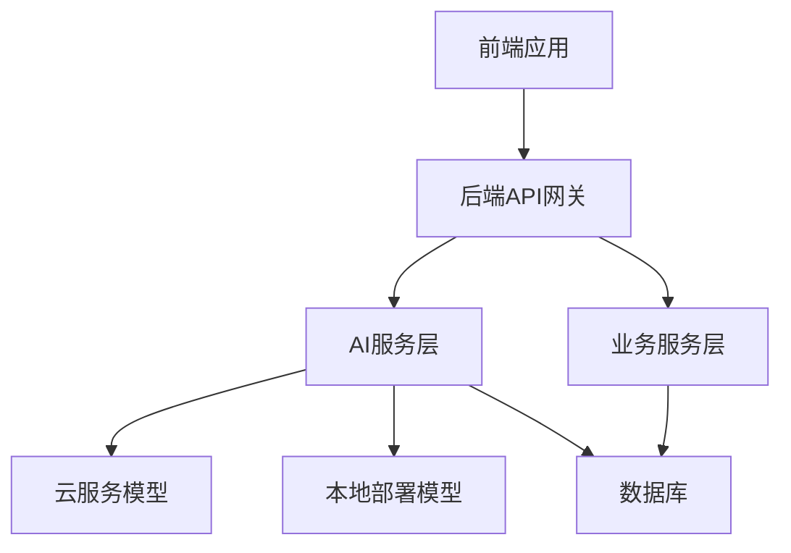

# AI模型集成方案文档

## 1. 文档概述

本文档定义了智码引擎 AI驱动低代码开发平台的AI模型集成方案，旨在确保AI功能与平台无缝集成，提供高效、可靠、可扩展的AI服务支持。所有与AI相关的开发工作必须严格遵循本方案。

## 2. AI功能需求分析

### 2.1 核心AI功能
- **智能表单生成**：根据用户需求自动生成表单组件和代码
- **智能页面生成**：根据用户需求自动生成页面布局和代码
- **智能API生成**：根据数据库结构自动生成API接口和代码
- **智能代码优化**：自动优化生成的代码，提高性能和可维护性
- **智能错误修复**：自动检测和修复代码中的常见错误

### 2.2 AI功能应用场景
- 用户在蓝图编辑器中使用AI辅助功能
- 模板市场中的智能模板推荐
- 开发向导中的智能引导
- 代码审查和优化建议

## 3. 模型选择策略

### 3.1 模型类型选择
- **文本生成模型**：用于生成代码、文档等文本内容
  - 推荐模型：GPT-4o、Claude 3、通义千问、文心一言
- **代码生成模型**：专门用于生成代码
  - 推荐模型：CodeLlama、StarCoder、CodeGeeX
- **微调模型**：基于基础模型进行领域微调
  - 针对低代码开发场景进行微调

### 3.2 模型部署方式
- **云服务API**：直接调用第三方AI服务API
  - 优势：快速集成、无需维护模型和硬件
  - 劣势：依赖外部服务、成本较高、数据隐私风险
- **本地部署**：在本地服务器部署开源模型
  - 优势：数据隐私可控、无外部依赖
  - 劣势：需要专业硬件、维护成本高
- **混合部署**：关键数据使用本地模型，通用功能使用云服务
  - 优势：平衡隐私和成本
  - 劣势：架构复杂度高

### 3.3 最终选择
- **初期**：使用云服务API进行快速集成（GPT-4o + CodeLlama）
- **中期**：引入通义千问等国内模型，降低依赖风险
- **长期**：针对核心功能开发本地微调模型，提高性能和安全性

## 4. 集成架构设计

### 4.1 整体架构



### 4.2 AI服务层设计
- **AI服务管理器**：统一管理不同类型的AI模型
- **模型适配器**：为不同AI模型提供统一接口
- **请求调度器**：根据请求类型和优先级分配模型资源
- **缓存管理器**：缓存频繁使用的AI响应，提高性能
- **监控统计器**：监控AI服务性能和使用情况

### 4.3 技术栈
- **AI服务层框架**：FastAPI
- **模型部署工具**：vLLM、Transformers
- **缓存**：Redis
- **监控**：Prometheus + Grafana

## 5. API设计

### 5.1 AI服务API基础路径
- 基础URL：`/api/v1/ai`

### 5.2 核心API接口

#### 5.2.1 智能表单生成
```
POST /api/v1/ai/generate-form
```

**请求参数**：
```json
{
  "requirements": "创建一个用户信息表单，包含姓名、邮箱、手机号、出生日期、地址等字段",
  "framework": "vue3",
  "ui_library": "element-plus",
  "validation_rules": true
}
```

**响应参数**：
```json
{
  "code": 200,
  "msg": "生成成功",
  "data": {
    "component_code": "<el-form>...</el-form>",
    "validation_code": "{
      name: [
        { required: true, message: '请输入姓名', trigger: 'blur' }
      ]
    }",
    "preview_html": "<form>...</form>",
    "suggestions": ["建议添加表单提交按钮", "建议为手机号字段添加格式验证"]
  }
}
```

#### 5.2.2 智能页面生成
```
POST /api/v1/ai/generate-page
```

**请求参数**：
```json
{
  "requirements": "创建一个团队管理页面，包含团队列表、搜索、添加、编辑、删除功能",
  "framework": "vue3",
  "ui_library": "element-plus",
  "layout": "table"
}
```

**响应参数**：
```json
{
  "code": 200,
  "msg": "生成成功",
  "data": {
    "template_code": "<template>...</template>",
    "script_code": "<script setup>...</script>",
    "style_code": "<style scoped>...</style>",
    "preview_html": "<div>...</div>",
    "dependencies": ["element-plus", "@element-plus/icons-vue"]
  }
}
```

#### 5.2.3 智能API生成
```
POST /api/v1/ai/generate-api
```

**请求参数**：
```json
{
  "database_schema": "{
    "table_name": "teams",
    "columns": [
      { "name": "id", "type": "int", "primary_key": true },
      { "name": "name", "type": "varchar(100)", "not_null": true },
      { "name": "description", "type": "text" }
    ]
  }",
  "framework": "fastapi",
  "crud_operations": ["create", "read", "update", "delete"]
}
```

**响应参数**：
```json
{
  "code": 200,
  "msg": "生成成功",
  "data": {
    "router_code": "@router.get('/teams')\nasync def get_teams():...",
    "model_code": "class Team(BaseModel):...",
    "crud_code": "async def create_team(team: TeamCreate):...",
    "documentation": "# 团队管理API\n\n## 获取团队列表\n..."
  }
}
```

#### 5.2.4 智能代码优化
```
POST /api/v1/ai/optimize-code
```

**请求参数**：
```json
{
  "code": "function calculateSum(a, b) {\n  let sum = 0;\n  sum = a + b;\n  return sum;\n}",
  "language": "javascript",
  "optimization_goals": ["performance", "readability"]
}
```

**响应参数**：
```json
{
  "code": 200,
  "msg": "优化成功",
  "data": {
    "optimized_code": "const calculateSum = (a, b) => a + b;",
    "improvements": ["简化了函数定义", "移除了不必要的变量赋值"],
    "metrics": {
      "original_lines": 5,
      "optimized_lines": 1,
      "reduction_percentage": 80
    }
  }
}
```

## 6. 性能与可扩展性

### 6.1 性能优化策略
- **请求缓存**：缓存频繁使用的AI响应
- **异步处理**：使用异步请求处理长时间运行的AI任务
- **批量处理**：合并多个相似请求，减少API调用次数
- **模型选择**：根据请求复杂度选择合适的模型

### 6.2 可扩展性设计
- **模型横向扩展**：支持添加新的AI模型
- **服务集群部署**：支持AI服务的集群部署
- **自动扩缩容**：根据负载自动调整服务资源

### 6.3 性能指标
- **响应时间**：
  - 简单请求：< 1秒
  - 中等请求：< 3秒
  - 复杂请求：< 10秒
- **并发处理能力**：
  - 初期：100 QPS
  - 中期：500 QPS
  - 长期：1000+ QPS

## 7. 安全与隐私

### 7.1 数据安全
- **数据加密**：传输和存储过程中对敏感数据进行加密
- **数据脱敏**：在发送数据到AI模型前进行脱敏处理
- **数据隔离**：不同用户的数据严格隔离

### 7.2 隐私保护
- **数据使用限制**：明确AI模型对数据的使用范围
- **用户授权**：获取用户明确授权后使用数据
- **数据删除**：支持用户删除已提交的数据

### 7.3 安全审计
- **请求日志**：记录所有AI请求和响应
- **访问控制**：限制AI服务的访问权限
- **异常检测**：检测异常请求和响应

## 8. 测试与部署

### 8.1 测试策略
- **单元测试**：测试AI服务的各个组件
- **集成测试**：测试AI服务与其他服务的集成
- **性能测试**：测试AI服务的响应时间和并发处理能力
- **准确性测试**：测试AI生成结果的准确性
- **A/B测试**：比较不同AI模型的性能

### 8.2 部署策略
- **容器化部署**：使用Docker和Kubernetes部署AI服务
- **滚动更新**：支持无停机更新AI服务
- **灰度发布**：逐步将新功能推向用户

## 9. 监控与维护

### 9.1 监控指标
- **服务指标**：响应时间、错误率、QPS
- **模型指标**：准确率、召回率、生成质量
- **资源指标**：CPU、内存、GPU使用率

### 9.2 日志管理
- **请求日志**：记录所有AI请求和响应
- **错误日志**：记录AI服务的错误信息
- **性能日志**：记录AI服务的性能数据

### 9.3 维护计划
- **定期模型更新**：根据需要更新AI模型
- **性能优化**：定期优化AI服务性能
- **故障恢复**：制定详细的故障恢复计划

## 10. 成本控制

### 10.1 成本分析
- **API调用成本**：根据调用次数和模型复杂度计算
- **硬件成本**：本地部署模型的服务器和GPU成本
- **维护成本**：AI服务的维护和优化成本

### 10.2 成本优化策略
- **请求缓存**：减少API调用次数
- **模型选择**：根据需求选择成本合适的模型
- **批量处理**：合并多个请求，提高效率
- **资源调度**：合理分配硬件资源，提高利用率

## 11. 风险评估与应对

### 11.1 技术风险
- **模型性能不稳定**：解决方案：使用多模型备份、监控性能指标
- **API调用失败**：解决方案：实现重试机制、设置超时时间
- **生成结果质量差**：解决方案：建立质量评估机制、人工审核重要结果

### 11.2 业务风险
- **依赖外部服务**：解决方案：逐步引入本地模型、降低依赖风险
- **数据隐私问题**：解决方案：严格遵守数据隐私法规、加强数据保护
- **成本超支**：解决方案：建立成本监控机制、优化资源使用

## 12. 实施计划

### 12.1 第一阶段（1-2周）
- 完成AI服务层架构设计
- 集成GPT-4o和CodeLlama模型
- 实现核心AI功能API

### 12.2 第二阶段（2-3周）
- 实现AI功能与前端的集成
- 进行性能测试和优化
- 完善监控和日志系统

### 12.3 第三阶段（3-4周）
- 引入通义千问等国内模型
- 实现高级AI功能
- 进行全面测试和优化

## 13. 附录

### 13.1 模型参数配置
| 模型名称 | 温度参数 | 最大长度 | 停止条件 |
|---------|---------|---------|---------|
| GPT-4o | 0.7 | 8192 | ['\n\n', '</code>', '</form>'] |
| CodeLlama | 0.5 | 16384 | ['\n\n', '</code>', '```'] |
| 通义千问 | 0.8 | 4096 | ['\n\n', '</code>', '</div>'] |

### 13.2 API调用示例
```python
import requests
import json

url = "http://localhost:8000/api/v1/ai/generate-form"
headers = {
    "Content-Type": "application/json",
    "Authorization": "Bearer your-token-here"
}
payload = {
    "requirements": "创建一个登录表单，包含用户名和密码字段",
    "framework": "vue3",
    "ui_library": "element-plus"
}

response = requests.post(url, headers=headers, data=json.dumps(payload))
print(response.json())
```

---

**文档版本**：v1.0
**制定日期**：2025-12-16
**更新日期**：2025-12-16
**审核人**：技术负责人、AI技术专家