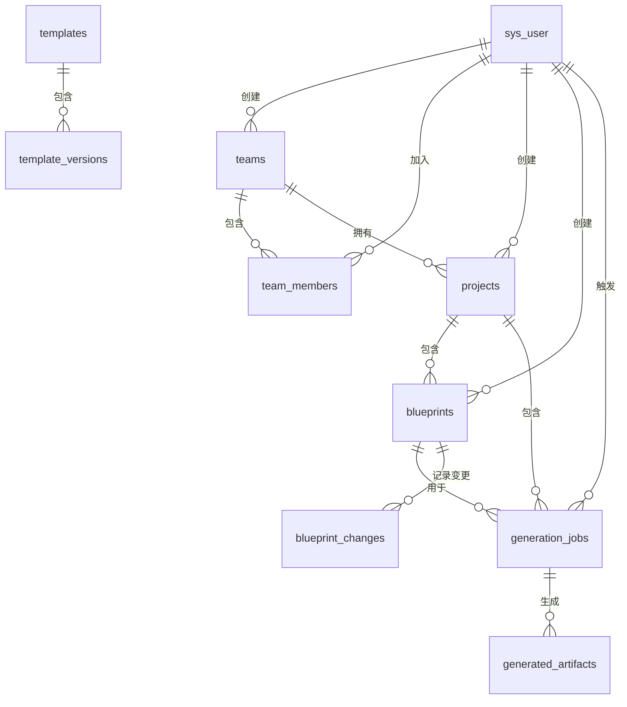

# 数据模型与数据库设计文档

## 1. 数据库设计概述

### 1.1 设计目标
基于RuoYi-FastAPI现有数据库表结构，扩展设计智码引擎所需的数据模型，支持团队管理、项目管理、蓝图管理、生成任务管理等核心功能。

### 1.2 设计原则
- **兼容性**：与RuoYi-FastAPI现有表结构兼容，避免破坏性变更
- **扩展性**：采用模块化设计，便于未来功能扩展
- **性能**：合理设计索引，优化查询性能
- **安全性**：严格的数据访问控制，保护敏感数据
- **标准化**：遵循数据库设计规范，使用UUID作为主键

## 2. 核心数据模型

### 2.1 用户扩展模型

**表名**：`sys_user`（扩展原有表）

| 字段名 | 数据类型 | 约束 | 描述 |
|-------|---------|------|------|
| `user_id` | `BIGINT(20)` | PRIMARY KEY | 用户ID（原有） |
| `display_name` | `VARCHAR(100)` | | 显示名称（新增） |
| `avatar_url` | `TEXT` | | 头像地址（新增） |
| `role` | `VARCHAR(50)` | DEFAULT 'user' | 用户角色（新增） |
| `email_verified` | `BOOLEAN` | DEFAULT FALSE | 邮箱是否验证（新增） |
| `uuid` | `CHAR(36)` | UNIQUE | UUID标识（新增） |
| `last_login_at` | `DATETIME` | | 最后登录时间（新增） |

### 2.2 团队管理模型

#### 团队表
**表名**：`teams`

| 字段名 | 数据类型 | 约束 | 描述 |
|-------|---------|------|------|
| `id` | `CHAR(36)` | PRIMARY KEY | 团队ID |
| `name` | `VARCHAR(200)` | NOT NULL | 团队名称 |
| `slug` | `VARCHAR(100)` | UNIQUE NOT NULL | 团队URL标识 |
| `description` | `TEXT` | | 团队描述 |
| `logo_url` | `TEXT` | | 团队logo |
| `subscription_plan` | `VARCHAR(50)` | DEFAULT 'free' | 订阅计划 |
| `subscription_status` | `VARCHAR(20)` | DEFAULT 'active' | 订阅状态 |
| `subscription_ends_at` | `DATETIME` | | 订阅到期时间 |
| `created_by_user_id` | `BIGINT(20)` | FOREIGN KEY | 创建者用户ID |
| `created_at` | `DATETIME` | DEFAULT CURRENT_TIMESTAMP | 创建时间 |
| `updated_at` | `DATETIME` | DEFAULT CURRENT_TIMESTAMP ON UPDATE CURRENT_TIMESTAMP | 更新时间 |

#### 团队成员表
**表名**：`team_members`

| 字段名 | 数据类型 | 约束 | 描述 |
|-------|---------|------|------|
| `id` | `CHAR(36)` | PRIMARY KEY | 团队成员ID |
| `team_id` | `CHAR(36)` | NOT NULL FOREIGN KEY | 团队ID |
| `user_id` | `BIGINT(20)` | NOT NULL FOREIGN KEY | 用户ID |
| `role` | `VARCHAR(50)` | DEFAULT 'member' | 成员角色 |
| `joined_at` | `DATETIME` | DEFAULT CURRENT_TIMESTAMP | 加入时间 |
| `invited_by_user_id` | `BIGINT(20)` | FOREIGN KEY | 邀请者用户ID |
| `invited_at` | `DATETIME` | | 邀请时间 |
| `created_at` | `DATETIME` | DEFAULT CURRENT_TIMESTAMP | 创建时间 |

### 2.3 项目与蓝图模型

#### 项目表
**表名**：`projects`

| 字段名 | 数据类型 | 约束 | 描述 |
|-------|---------|------|------|
| `id` | `CHAR(36)` | PRIMARY KEY | 项目ID |
| `team_id` | `CHAR(36)` | NOT NULL FOREIGN KEY | 团队ID |
| `name` | `VARCHAR(200)` | NOT NULL | 项目名称 |
| `slug` | `VARCHAR(100)` | NOT NULL | 项目标识 |
| `description` | `TEXT` | | 项目描述 |
| `tech_stack` | `JSON` | | 技术栈配置 |
| `status` | `VARCHAR(20)` | DEFAULT 'active' | 项目状态 |
| `is_public` | `BOOLEAN` | DEFAULT FALSE | 是否公开 |
| `storage_quota_mb` | `INTEGER` | DEFAULT 1024 | 存储配额 |
| `created_by_user_id` | `BIGINT(20)` | FOREIGN KEY | 创建者用户ID |
| `created_at` | `DATETIME` | DEFAULT CURRENT_TIMESTAMP | 创建时间 |
| `updated_at` | `DATETIME` | DEFAULT CURRENT_TIMESTAMP ON UPDATE CURRENT_TIMESTAMP | 更新时间 |

#### 蓝图表
**表名**：`blueprints`

| 字段名 | 数据类型 | 约束 | 描述 |
|-------|---------|------|------|
| `id` | `CHAR(36)` | PRIMARY KEY | 蓝图ID |
| `project_id` | `CHAR(36)` | NOT NULL FOREIGN KEY | 项目ID |
| `name` | `VARCHAR(200)` | NOT NULL | 蓝图名称 |
| `description` | `TEXT` | | 蓝图描述 |
| `version_tag` | `VARCHAR(50)` | NOT NULL | 版本标签 |
| `spec_document_id` | `VARCHAR(100)` | | 文档存储ID |
| `spec_summary` | `JSON` | | 蓝图摘要信息 |
| `is_draft` | `BOOLEAN` | DEFAULT TRUE | 是否为草稿 |
| `parent_blueprint_id` | `CHAR(36)` | FOREIGN KEY | 父蓝图ID |
| `created_by_user_id` | `BIGINT(20)` | FOREIGN KEY | 创建者用户ID |
| `created_at` | `DATETIME` | DEFAULT CURRENT_TIMESTAMP | 创建时间 |
| `updated_at` | `DATETIME` | DEFAULT CURRENT_TIMESTAMP ON UPDATE CURRENT_TIMESTAMP | 更新时间 |

### 2.4 生成任务模型

#### 生成任务表
**表名**：`generation_jobs`

| 字段名 | 数据类型 | 约束 | 描述 |
|-------|---------|------|------|
| `id` | `CHAR(36)` | PRIMARY KEY | 任务ID |
| `project_id` | `CHAR(36)` | NOT NULL FOREIGN KEY | 项目ID |
| `blueprint_id` | `CHAR(36)` | NOT NULL FOREIGN KEY | 蓝图ID |
| `status` | `VARCHAR(50)` | DEFAULT 'pending' | 任务状态 |
| `target_tech_stack` | `JSON` | | 目标技术栈配置 |
| `trigger_type` | `VARCHAR(50)` | DEFAULT 'manual' | 触发类型 |
| `triggered_by_user_id` | `BIGINT(20)` | FOREIGN KEY | 触发者用户ID |
| `started_at` | `DATETIME` | | 开始时间 |
| `completed_at` | `DATETIME` | | 完成时间 |
| `error_message` | `TEXT` | | 错误信息 |
| `logs` | `JSON` | | 生成日志 |
| `qa_report` | `JSON` | | 质量检查报告 |
| `created_at` | `DATETIME` | DEFAULT CURRENT_TIMESTAMP | 创建时间 |

#### 生成产物表
**表名**：`generated_artifacts`

| 字段名 | 数据类型 | 约束 | 描述 |
|-------|---------|------|------|
| `id` | `CHAR(36)` | PRIMARY KEY | 产物ID |
| `job_id` | `CHAR(36)` | NOT NULL FOREIGN KEY | 生成任务ID |
| `artifact_type` | `VARCHAR(50)` | NOT NULL | 产物类型 |
| `artifact_name` | `VARCHAR(255)` | NOT NULL | 产物名称 |
| `storage_type` | `VARCHAR(50)` | DEFAULT 'local' | 存储类型 |
| `storage_path` | `TEXT` | NOT NULL | 存储路径 |
| `storage_url` | `TEXT` | | 访问URL |
| `file_size_bytes` | `BIGINT` | | 文件大小 |
| `mime_type` | `VARCHAR(100)` | | 文件类型 |
| `checksum` | `VARCHAR(255)` | | 校验和 |
| `is_compressed` | `BOOLEAN` | DEFAULT TRUE | 是否压缩 |
| `created_at` | `DATETIME` | DEFAULT CURRENT_TIMESTAMP | 创建时间 |

## 3. 数据库关系图

## 4. 索引设计

### 4.1 核心表索引

| 表名 | 索引字段 | 索引类型 | 用途 |
|------|---------|---------|------|
| `teams` | `subscription_status` | 普通索引 | 订阅状态查询 |
| `teams` | `created_by_user_id` | 普通索引 | 按创建者查询团队 |
| `team_members` | `team_id` | 普通索引 | 按团队查询成员 |
| `team_members` | `user_id` | 普通索引 | 按用户查询所属团队 |
| `projects` | `team_id` | 普通索引 | 按团队查询项目 |
| `projects` | `status` | 普通索引 | 按状态查询项目 |
| `blueprints` | `project_id` | 普通索引 | 按项目查询蓝图 |
| `blueprints` | `is_draft` | 普通索引 | 按草稿状态查询蓝图 |
| `generation_jobs` | `project_id` | 普通索引 | 按项目查询生成任务 |
| `generation_jobs` | `status` | 普通索引 | 按状态查询生成任务 |

### 4.2 唯一索引

| 表名 | 索引字段 | 用途 |
|------|---------|------|
| `teams` | `slug` | 确保团队URL标识唯一 |
| `team_members` | `team_id, user_id` | 确保用户在团队中唯一 |
| `projects` | `team_id, slug` | 确保项目在团队内标识唯一 |
| `blueprints` | `project_id, version_tag` | 确保蓝图版本在项目内唯一 |

## 5. 数据安全与备份策略

### 5.1 数据安全
- **加密存储**：敏感数据（如密码）进行加密存储
- **访问控制**：基于RBAC权限模型，严格控制数据访问权限
- **审计日志**：记录所有数据操作，便于追溯

### 5.2 备份策略
- **定期备份**：每日全量备份，每小时增量备份
- **备份验证**：定期验证备份数据的完整性
- **灾难恢复**：制定灾难恢复计划，确保数据可恢复

## 6. 表结构SQL

详细的表结构SQL语句请参考 `ruoyi-fastapi-backend/sql/codemind_engine.sql` 文件。
