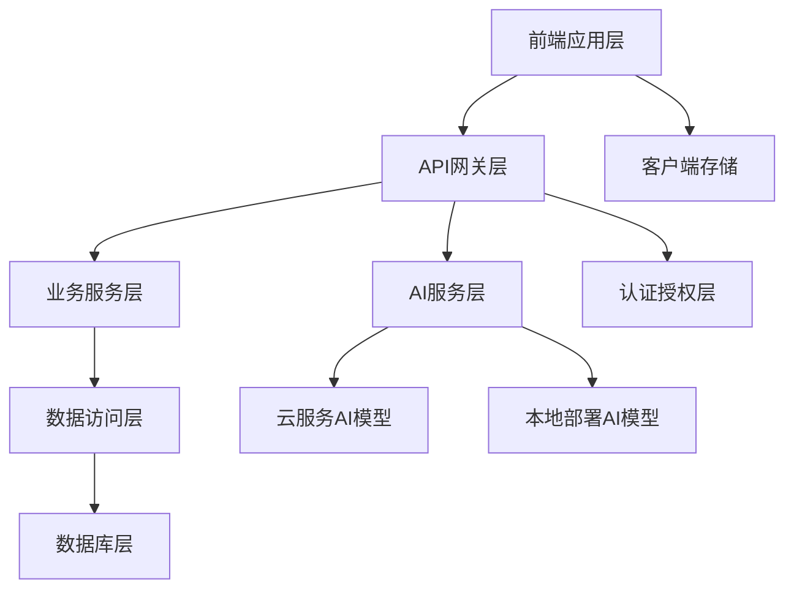
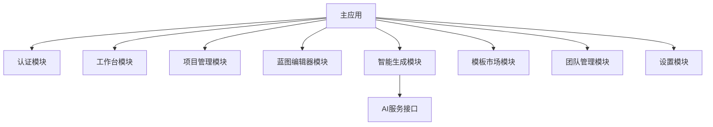
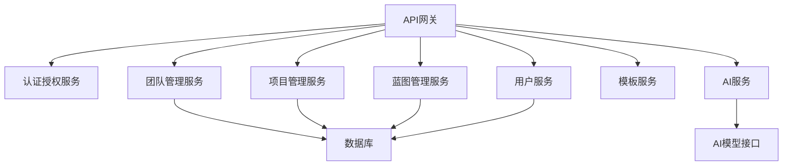
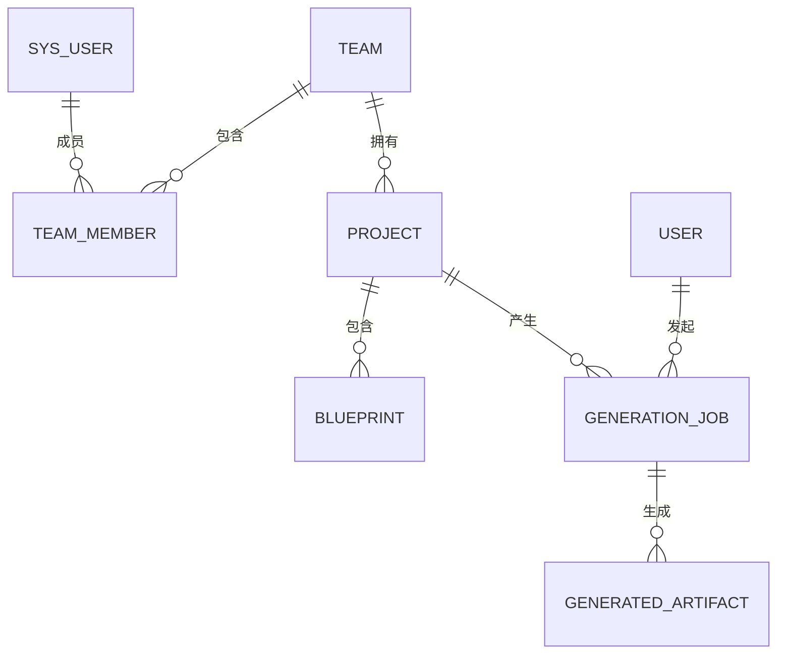
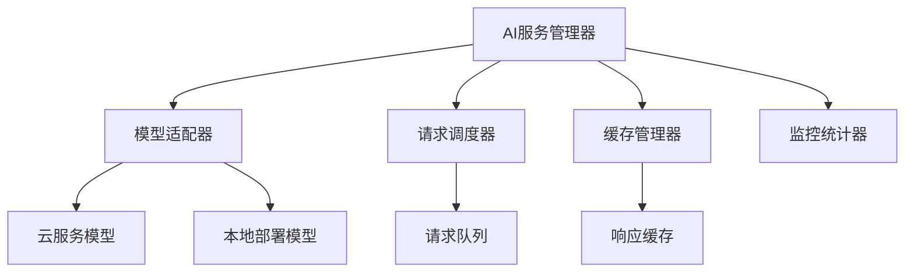
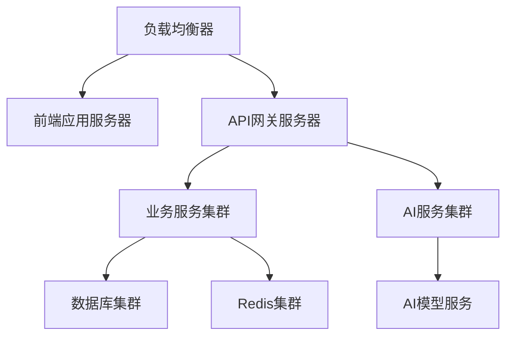
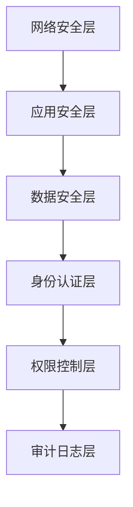

# 最终技术架构文档

## 1. 文档概述

本文档是智码引擎 AI驱动低代码开发平台的最终技术架构文档，整合了API接口设计、数据模型与数据库设计、Pinia状态管理设计、前后端交互规范和AI模型集成方案等内容，为平台的技术实现提供完整的指导。

## 2. 系统架构总览

### 2.1 整体架构图



### 2.2 核心技术栈

| 层次 | 技术选型 | 版本 | 说明 |
|------|---------|------|------|
| 前端框架 | Vue | 3.x | 核心前端框架 |
| 状态管理 | Pinia | 2.x | 全局状态管理 |
| UI组件库 | Element Plus | 2.x | 企业级UI组件库 |
| 样式方案 | Tailwind CSS + SCSS | 3.x | 现代化样式解决方案 |
| 后端框架 | FastAPI | 0.100+ | 高性能API框架 |
| 数据库 | MySQL | 8.x | 关系型数据库 |
| 缓存 | Redis | 7.x | 高性能缓存 |
| AI模型 | GPT-4o、CodeLlama | 最新 | AI代码生成和优化 |
| 认证 | JWT | - | 无状态身份认证 |

## 3. 前端架构设计

### 3.1 模块划分



### 3.2 Pinia状态管理

#### 3.2.1 核心模块结构

| 模块名称 | 主要功能 | 状态存储 | 核心Actions |
|---------|---------|---------|-------------|
| User | 用户信息管理 | token, id, name, avatar, roles | login, logout, getInfo |
| App | 应用配置管理 | sidebar, device, size | toggleSideBar, setSize |
| Team | 团队管理 | currentTeam, teams, teamMembers | getTeams, setCurrentTeam, createTeam |
| Project | 项目管理 | currentProject, projects | getProjects, setCurrentProject, createProject |
| Blueprint | 蓝图管理 | currentBlueprint, blueprints | getBlueprints, setCurrentBlueprint, createBlueprint |
| Generation | 生成任务管理 | generationJobs, currentJob | createGenerationJob, getGenerationResult |

#### 3.2.2 状态持久化策略

| 状态类型 | 持久化方式 | 存储位置 | 生命周期 |
|---------|-----------|---------|---------|
| 认证信息 | 加密存储 | Cookie + localStorage | 登录会话期间 |
| 应用配置 | 加密存储 | Cookie | 浏览器会话期间 |
| 业务状态 | 普通存储 | localStorage | 持久化 |
| 临时状态 | 不存储 | 内存 | 页面会话期间 |

## 4. 后端架构设计

### 4.1 模块划分



### 4.2 API接口设计

#### 4.2.1 接口基础规范
- **基础URL**：`/api/v1`
- **响应格式**：
  ```json
  {
    "code": 200,
    "msg": "操作成功",
    "data": {}
  }
  ```

#### 4.2.2 核心接口列表

| 模块 | 接口路径 | 方法 | 功能描述 |
|------|---------|------|---------|
| 用户管理 | `/api/v1/users/login` | POST | 用户登录 |
| 用户管理 | `/api/v1/users/info` | GET | 获取用户信息 |
| 团队管理 | `/api/v1/teams` | GET | 获取团队列表 |
| 团队管理 | `/api/v1/teams` | POST | 创建团队 |
| 项目管理 | `/api/v1/projects` | GET | 获取项目列表 |
| 项目管理 | `/api/v1/projects` | POST | 创建项目 |
| 蓝图管理 | `/api/v1/blueprints` | GET | 获取蓝图列表 |
| 蓝图管理 | `/api/v1/blueprints` | POST | 创建蓝图 |
| AI服务 | `/api/v1/ai/generate-form` | POST | 生成表单 |
| AI服务 | `/api/v1/ai/generate-page` | POST | 生成页面 |

## 5. 数据模型与数据库设计

### 5.1 核心数据模型

#### 5.1.1 用户扩展模型

| 字段名 | 数据类型 | 约束 | 说明 |
|-------|---------|------|------|
| user_id | bigint | PRIMARY KEY | 用户ID（复用sys_user表） |
| display_name | varchar(50) | NOT NULL | 显示名称 |
| avatar_url | varchar(255) | | 头像URL |
| bio | text | | 个人简介 |
| created_at | datetime | NOT NULL | 创建时间 |
| updated_at | datetime | NOT NULL | 更新时间 |

#### 5.1.2 团队管理模型

| 字段名 | 数据类型 | 约束 | 说明 |
|-------|---------|------|------|
| team_id | bigint | PRIMARY KEY | 团队ID |
| name | varchar(100) | NOT NULL | 团队名称 |
| description | text | | 团队描述 |
| created_by | bigint | NOT NULL | 创建人ID |
| created_at | datetime | NOT NULL | 创建时间 |
| updated_at | datetime | NOT NULL | 更新时间 |

#### 5.1.3 项目与蓝图模型

| 字段名 | 数据类型 | 约束 | 说明 |
|-------|---------|------|------|
| project_id | bigint | PRIMARY KEY | 项目ID |
| team_id | bigint | NOT NULL | 所属团队ID |
| name | varchar(100) | NOT NULL | 项目名称 |
| description | text | | 项目描述 |
| status | tinyint | NOT NULL | 项目状态 |
| created_by | bigint | NOT NULL | 创建人ID |
| created_at | datetime | NOT NULL | 创建时间 |
| updated_at | datetime | NOT NULL | 更新时间 |

| 字段名 | 数据类型 | 约束 | 说明 |
|-------|---------|------|------|
| blueprint_id | bigint | PRIMARY KEY | 蓝图ID |
| project_id | bigint | NOT NULL | 所属项目ID |
| name | varchar(100) | NOT NULL | 蓝图名称 |
| content | longtext | NOT NULL | 蓝图内容（JSON格式） |
| preview_html | longtext | | 预览HTML |
| status | tinyint | NOT NULL | 蓝图状态 |
| created_by | bigint | NOT NULL | 创建人ID |
| created_at | datetime | NOT NULL | 创建时间 |
| updated_at | datetime | NOT NULL | 更新时间 |

### 5.2 数据库关系图



## 6. 前后端交互规范

### 6.1 通信协议
- 所有API接口必须使用 `HTTPS` 协议
- API请求方法遵循RESTful设计原则

### 6.2 数据格式
- 请求和响应数据必须使用 `JSON` 格式
- JSON字段命名使用 `snake_case` 格式

### 6.3 错误处理
- 统一的错误响应格式：
  ```json
  {
    "code": 400,
    "msg": "请求参数错误",
    "data": null
  }
  ```

### 6.4 安全规范
- 使用JWT进行身份认证
- 实现RBAC权限控制
- 正确配置CORS策略
- 防止常见安全攻击

## 7. AI模型集成方案

### 7.1 AI服务架构



### 7.2 核心AI功能

| 功能 | 模型选择 | API路径 | 说明 |
|------|---------|---------|------|
| 智能表单生成 | GPT-4o | `/api/v1/ai/generate-form` | 根据需求生成表单代码 |
| 智能页面生成 | GPT-4o | `/api/v1/ai/generate-page` | 根据需求生成页面代码 |
| 智能API生成 | CodeLlama | `/api/v1/ai/generate-api` | 根据数据库结构生成API |
| 智能代码优化 | CodeLlama | `/api/v1/ai/optimize-code` | 优化现有代码 |

### 7.3 性能与成本优化
- 实现请求缓存减少API调用
- 根据请求复杂度选择合适模型
- 批量处理相似请求提高效率
- 建立成本监控和预警机制

## 8. 部署与运维架构

### 8.1 部署架构



### 8.2 监控与告警

| 监控对象 | 监控指标 | 告警阈值 |
|---------|---------|---------|
| 应用服务器 | CPU使用率 | > 80% |
| 应用服务器 | 内存使用率 | > 85% |
| API接口 | 响应时间 | > 2秒 |
| API接口 | 错误率 | > 5% |
| 数据库 | 查询时间 | > 1秒 |
| 数据库 | 连接数 | > 80% |
| AI服务 | 调用失败率 | > 3% |

## 9. 系统安全架构

### 9.1 安全层次



### 9.2 核心安全措施

| 措施 | 实现方式 | 说明 |
|------|---------|------|
| 数据加密 | HTTPS、AES-256 | 传输和存储加密 |
| 身份认证 | JWT、双因素认证 | 安全身份验证 |
| 权限控制 | RBAC、细粒度权限 | 最小权限原则 |
| 攻击防护 | WAF、SQL注入过滤 | 防止常见攻击 |
| 审计日志 | 完整日志记录 | 操作可追溯 |

## 10. 系统扩展性设计

### 10.1 水平扩展
- 前端应用：静态资源CDN分发
- 后端服务：无状态服务设计，支持容器化部署
- 数据库：读写分离、分库分表

### 10.2 垂直扩展
- 功能模块化设计，支持插件式扩展
- API版本管理，支持平滑升级
- AI模型可插拔设计，支持动态切换

## 11. 开发与测试流程

### 11.1 开发流程
- 采用敏捷开发方式，双周迭代
- 使用GitFlow工作流进行代码管理
- 严格的代码审查和质量控制

### 11.2 测试策略
- 单元测试：覆盖率>80%
- 集成测试：API接口测试
- 端到端测试：核心业务流程测试
- 性能测试：压力和负载测试

## 12. 技术决策总结

### 12.1 核心决策点

| 决策点 | 技术选型 | 决策理由 |
|-------|---------|---------|
| 前端框架 | Vue 3 | 现代化、高性能、生态成熟 |
| 状态管理 | Pinia | 轻量、直观、TypeScript友好 |
| 后端框架 | FastAPI | 高性能、自动生成文档、TypeScript支持 |
| 数据库 | MySQL | 成熟稳定、生态完善、适合关系型数据 |
| AI模型 | GPT-4o + CodeLlama | 代码生成质量高、支持多种语言 |

### 12.2 技术风险与应对

| 风险 | 影响 | 应对策略 |
|------|------|---------|
| 外部AI服务依赖 | 服务不可用、成本波动 | 混合部署策略、多模型备份 |
| 前端性能问题 | 用户体验差 | 代码分割、懒加载、缓存策略 |
| 数据库性能瓶颈 | 系统响应慢 | 索引优化、读写分离、缓存 |
| 安全漏洞 | 数据泄露、系统被攻击 | 定期安全审计、漏洞扫描、及时更新 |

## 13. 未来技术规划

### 13.1 短期规划（6个月内）
- 完成核心功能开发和测试
- 实现AI功能与平台的深度集成
- 优化系统性能和用户体验

### 13.2 中期规划（6-12个月）
- 引入更多AI模型和功能
- 实现平台的多租户支持
- 开发移动端应用

### 13.3 长期规划（12个月以上）
- 开发本地微调的AI模型
- 实现平台的国际化支持
- 构建开发者生态系统

---

**文档版本**：V1.0
**制定日期**：2025-12-16
**审核人**：技术负责人、前端架构师、后端架构师
**批准人**：项目总监