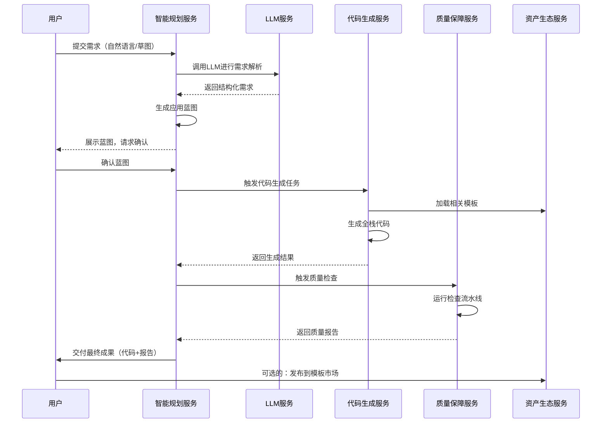

# **智码引擎：业务架构与完整流程设计**

## **一、 核心业务架构总览**

### **1.1 业务架构层级模型**

```
┌─────────────────────────────────────────────────────────────────────────┐
│                        **业务能力层 (Business Capabilities)**                │
├─────────────────────────────────────────────────────────────────────────┤
│     需求转换       代码生产       质量保障        协作管理        生态运营  │
│  ┌──────────┐  ┌──────────┐  ┌──────────┐  ┌──────────┐  ┌──────────┐  │
│  │ 智能规划  │  │ 代码生成  │  │ 质量检查  │  │ 团队协作  │  │ 模板市场  │  │
│  └──────────┘  └──────────┘  └──────────┘  └──────────┘  └──────────┘  │
├─────────────────────────────────────────────────────────────────────────┤
│                       **平台服务层 (Platform Services)**                    │
├─────────────────────────────────────────────────────────────────────────┤
│  智能规划服务    代码生成服务    质量保障服务    资产生态服务    用户服务    │
│  (Orchestrator)  (Code Factory) (QA Pipeline)  (Asset Hub)   (User Service)│
├─────────────────────────────────────────────────────────────────────────┤
│                       **核心数据层 (Core Data Layer)**                      │
├─────────────────────────────────────────────────────────────────────────┤
│    统一应用元模型(UAM)    业务实体模型       系统配置数据       运营数据     │
│  (Application Blueprint) (Domain Models)  (Configuration)  (Operation)   │
└─────────────────────────────────────────────────────────────────────────┘
```

### **1.2 业务能力矩阵**

| 能力域 | 核心能力 | 关键业务价值 | 度量指标 |
|--------|----------|--------------|----------|
| **智能需求转换** | 多模态需求解析、蓝图生成、架构决策 | 降低需求沟通成本，提升设计效率 | 需求解析准确率、蓝图生成时间 |
| **自动化代码生产** | 全栈代码生成、模板驱动、多技术栈支持 | 减少重复编码，提升交付速度 | 代码生成量、生成成功率 |
| **智能化质量保障** | 静态分析、契约验证、测试生成 | 确保代码质量，降低后期维护成本 | 缺陷密度、测试覆盖率 |
| **协作与流程管理** | 团队协作、版本控制、项目管理 | 提升团队协作效率，规范开发流程 | 团队活跃度、项目交付周期 |
| **生态运营** | 模板市场、开发者社区、知识库 | 构建平台生态，增强用户粘性 | 模板交易量、社区活跃度 |

## **二、 端到端业务流程**

### **2.1 核心价值流：从需求到部署**

```
┌─────────┐     ┌─────────────┐     ┌─────────────┐     ┌─────────────┐
│  需求    │────▶│  智能规划    │────▶│  代码生成    │────▶│  质量保障    │
│ 输入     │     │  (蓝图生成)  │     │  (代码生产)  │     │  (质量检查)  │
└─────────┘     └─────────────┘     └─────────────┘     └─────────────┘
                                                     │
                                                     ▼
┌─────────┐     ┌─────────────┐     ┌─────────────┐     ┌─────────────┐
│  部署    │◀────│  项目管理    │◀────│  人工审查    │◀────│  交付验收    │
│ 上线     │     │  (版本管理)  │     │  (代码审查)  │     │  (用户验收)  │
└─────────┘     └─────────────┘     └─────────────┘     └─────────────┘
```

### **2.2 详细业务流程分解**

#### **流程1：用户注册与团队创建**
```yaml
步骤：
  1. 用户通过邮箱/手机注册账号
  2. 验证邮箱/手机，完善个人信息
  3. 创建或加入团队
  4. 选择订阅套餐（免费/团队/企业版）
  5. 配置团队基本信息和工作空间

参与者：
  - 终端用户
  - 用户服务
  - 支付服务（如适用）

输出物：
  - 用户账号
  - 团队空间
  - 订阅记录
```

#### **流程2：项目创建与需求输入**
```yaml
触发条件：用户需要创建新项目
步骤：
  1. 在团队空间点击"新建项目"
  2. 填写项目基本信息（名称、描述、技术栈偏好）
  3. 选择需求输入方式：
     a) 自然语言描述
     b) 上传草图/截图
     c) 导入已有PRD文档
     d) 从模板克隆
  4. 提交需求，进入智能规划队列

参与者：
  - 用户
  - 项目服务
  - 智能规划服务

输出物：
  - 项目记录
  - 原始需求文档
  - 智能规划任务
```

#### **流程3：智能规划与蓝图生成**
```yaml
触发条件：需求提交后
步骤：
  1. 智能规划服务接收需求
  2. 多模态解析器解析输入内容
  3. 需求澄清（如有模糊点，向用户提问）
  4. 多轮蓝图构建：
     a) 第一轮：识别数据模型和实体关系
     b) 第二轮：定义API接口契约
     c) 第三轮：设计页面和UI组件
     d) 第四轮：补充业务逻辑和部署配置
  5. 生成应用蓝图（JSON格式）
  6. 蓝图验证和冲突消解
  7. 返回蓝图给用户，等待确认或修改

参与者：
  - 智能规划服务
  - LLM服务
  - 知识库服务
  - 用户（确认或修改）

输出物：
  - 应用蓝图（UAM格式）
  - 蓝图变更记录
  - 验证报告
```

#### **流程4：代码生成与构建**
```yaml
触发条件：用户确认蓝图后
步骤：
  1. 代码生成服务接收蓝图
  2. 解析蓝图，确定技术栈
  3. 加载对应的生成插件和模板
  4. 分层生成代码：
     a) 框架层：项目结构和配置文件
     b) 领域层：数据模型和实体类
     c) API层：控制器和服务接口
     d) UI层：页面组件和样式
     e) 集成层：API客户端和类型定义
  5. 组装完整项目结构
  6. 生成项目元数据和文档
  7. 打包为可下载的代码包

参与者：
  - 代码生成服务
  - 模板引擎
  - 插件管理器

输出物：
  - 完整的源代码包
  - 项目文档
  - 生成日志
```

#### **流程5：质量保障与测试**
```yaml
触发条件：代码生成完成后自动触发
步骤：
  1. 质量保障服务接收源代码
  2. 自动化检查流水线：
     a) 代码格式化（Prettier/Biome）
     b) 静态分析（ESLint/TypeScript）
     c) 安全扫描（依赖漏洞检查）
     d) 契约一致性验证（前后端API对齐）
     e) 基础测试生成（Jest/Vitest）
     f) 构建打包测试（npm run build）
  3. 生成质量报告
  4. 自动修复可修复的问题
  5. 标记需要人工干预的问题

参与者：
  - 质量保障服务
  - 静态分析工具
  - 测试框架

输出物：
  - 质量检查报告
  - 修复后的代码（如适用）
  - 自动化测试用例
```

#### **流程6：人工审查与修改**
```yaml
触发条件：质量报告显示需要人工干预
步骤：
  1. 开发者收到审查通知
  2. 在线查看生成的代码和质量报告
  3. 使用在线IDE或本地环境审查代码
  4. 识别需要修改的部分：
     a) 复杂业务逻辑实现
     b) 特殊交互需求
     c) 性能优化点
     d) 与现有系统集成点
  5. 修改代码并提交变更
  6. 重新触发质量检查

参与者：
  - 开发者
  - 代码审查工具
  - 版本控制系统

输出物：
  - 修改后的代码
  - 审查记录
  - 新版本标签
```

#### **流程7：部署与发布**
```yaml
触发条件：代码通过质量检查
步骤：
  1. 配置部署环境（开发/测试/生产）
  2. 生成部署配置（Dockerfile、CI/CD流水线）
  3. 选择部署方式：
     a) 一键部署到平台托管环境
     b) 下载代码包自行部署
     c) 自动推送到Git仓库
  4. 执行部署脚本
  5. 监控部署状态
  6. 验证部署结果

参与者：
  - 用户/开发者
  - 部署服务
  - 云基础设施

输出物：
  - 部署成功的应用
  - 部署日志
  - 访问URL
```

#### **流程8：运维与迭代**
```yaml
触发条件：应用部署上线后
步骤：
  1. 监控应用运行状态
  2. 收集用户反馈和日志
  3. 分析性能数据和错误信息
  4. 规划迭代需求
  5. 通过蓝图版本管理进行增量修改
  6. 重新生成和部署新版本
  7. 版本回滚（如需要）

参与者：
  - 运维团队
  - 监控系统
  - 用户反馈系统

输出物：
  - 运维报告
  - 新版本应用
  - 用户反馈分析
```

## **三、 核心业务组件交互**

### **3.1 服务间协作流程**



### **3.2 数据流转过程**

```
用户需求
    ↓
[原始需求数据]
    ↓ 智能规划服务
[结构化需求清单]
    ↓
[应用蓝图V1] → [用户确认/修改] → [应用蓝图V2]
    ↓
[代码生成指令]
    ↓ 代码生成服务
[源代码文件集合]
    ↓
[质量检查输入]
    ↓ 质量保障服务
[质量报告 + 修复建议]
    ↓
[最终交付物]
    ↓
[部署配置] → [运行环境] → [线上应用]
```

## **四、 关键业务规则**

### **4.1 蓝图生成规则**

```yaml
规则集：数据模型推导
  - 当需求中提到"用户"、"商品"、"订单"等名词时，自动创建对应实体
  - 实体关系推导规则：
    * "用户拥有多个订单" → OneToMany关系
    * "订单包含多个商品" → ManyToMany关系
  - 字段类型推断：
    * 包含"邮箱"/"email" → 邮箱格式验证
    * 包含"电话"/"手机" → 手机号格式验证
    * 包含"时间"/"日期" → datetime类型

规则集：API自动生成
  - 每个数据实体自动生成标准CRUD API
  - 特殊操作识别：
    * "登录"/"注册" → 认证相关API
    * "搜索"/"筛选" → 查询参数增强
    * "导入"/"导出" → 批量操作API

规则集：UI组件选择
  - 数据列表展示 → 高级表格组件（ProTable）
  - 数据筛选查询 → 查询表单组件（QueryFilter）
  - 数据详情展示 → 详情页模板
  - 数据创建/编辑 → 模态框表单（ModalForm）
```

### **4.2 质量检查规则**

```yaml
规则集：代码规范检查
  - 必须通过ESLint规则检查
  - TypeScript编译不能有错误
  - 必须使用平台规定的代码风格
  
规则集：安全规则检查
  - 密码字段必须加密传输
  - 删除操作需要二次确认
  - SQL查询必须使用参数化
  
规则集：性能规则检查
  - 列表数据必须支持分页
  - 图片资源必须压缩
  - 组件必须支持懒加载
```

### **4.3 定价与计费规则**

```yaml
免费版规则：
  - 每月最多10次生成
  - 仅限基础技术栈
  - 生成代码仅供学习使用
  - 不支持团队协作
  
团队版规则：
  - 按席位数量计费
  - 支持完整技术栈
  - 包含团队协作功能
  - 私有模板库支持
  
企业版规则：
  - 定制化定价
  - 支持私有化部署
  - 专属技术支持
  - SLA服务保障
```

## **五、 业务异常处理流程**

### **5.1 常见异常场景及处理**

| 异常场景 | 发生阶段 | 处理策略 | 恢复措施 |
|----------|----------|----------|----------|
| **LLM服务不可用** | 智能规划 | 降级到规则引擎 | 使用预置模板，通知用户 |
| **蓝图验证失败** | 蓝图生成 | 自动修正循环 | 提示用户明确需求 |
| **代码生成超时** | 代码生成 | 任务重试机制 | 分析瓶颈，优化模板 |
| **质量检查不通过** | 质量保障 | 自动修复尝试 | 生成详细报告，人工干预 |
| **部署失败** | 部署发布 | 回滚到上一版本 | 检查环境配置，重新部署 |
| **支付失败** | 订阅续费 | 宽限期处理 | 提醒用户更新支付信息 |

### **5.2 用户支持流程**

```
用户问题反馈
    ↓
[自助服务] → 帮助中心/FAQ → 解决 → 流程结束
    ↓ 未解决
[智能客服] → 知识库匹配 → 解决 → 流程结束
    ↓ 未解决
[人工客服] → 问题分级处理 → 解决 → 流程结束
    ↓ 需要技术介入
[技术团队] → 问题排查修复 → 解决 → 流程结束
    ↓ 产品缺陷
[产品团队] → 需求分析和排期 → 后续版本修复
```

## **六、 业务指标与监控**

### **6.1 关键业务指标**

| 指标类别 | 具体指标 | 计算方式 | 目标值 |
|----------|----------|----------|----------|
| **用户增长** | 月活跃用户(MAU) | 每月登录用户数 | 月增长20% |
|          | 付费转化率 | 付费用户/总用户 | >5% |
| **生成效率** | 平均生成时间 | 需求提交到代码交付 | <10分钟 |
|          | 蓝图生成成功率 | 成功蓝图/总需求 | >90% |
| **代码质量** | 代码缺陷率 | 检查出的问题/代码行数 | <0.1% |
|          | 测试覆盖率 | 测试覆盖代码行/总代码行 | >70% |
| **用户满意** | NPS净推荐值 | 推荐者比例-贬损者比例 | >30 |
|          | 用户留存率 | 次月仍在使用的用户/上月总用户 | >80% |

### **6.2 业务监控仪表盘**

```yaml
实时监控视图：
  - 当前在线用户数
  - 进行中的生成任务数
  - 系统健康状态（各服务可用性）
  - 最新错误告警

生成分析视图：
  - 今日/本月生成次数
  - 生成成功率趋势图
  - 最常用技术栈分布
  - 平均生成时长变化

质量分析视图：
  - 代码缺陷类型分布
  - 自动修复成功率
  - 质量评分趋势
  - 常见问题Top10

运营分析视图：
  - 用户增长曲线
  - 付费转化漏斗
  - 用户留存分析
  - 收入趋势预测
```

## **七、 业务演进路线**

### **7.1 业务能力演进阶段**

**阶段1：核心能力验证（0-6个月）**
- 验证智能规划到代码生成的核心闭环
- 建立基础的用户和团队管理
- 实现单一技术栈（Vue3+NestJS）支持

**阶段2：产品化与商业化（7-18个月）**
- 扩展多技术栈支持（React+Spring Boot）
- 建立完善的质量保障体系
- 上线付费订阅系统
- 构建基础模板库

**阶段3：生态构建（19-36个月）**
- 开放模板市场和插件系统
- 建立开发者社区
- 提供企业级解决方案
- 探索国际化市场

### **7.2 业务扩展方向**

```yaml
横向扩展：
  - 支持更多前端框架（Angular、Svelte）
  - 支持更多后端语言（Go、Python、C#）
  - 支持移动端应用生成
  - 支持微服务架构生成

纵向深化：
  - 行业解决方案模板（电商、教育、医疗）
  - 复杂业务逻辑生成能力
  - AI优化建议和重构
  - 智能化运维和监控

生态构建：
  - 第三方开发者生态
  - 企业客户定制服务
  - 教育培训和认证
  - 技术咨询和外包服务
```

## **八、 风险管理与控制**

### **8.1 业务风险矩阵**

| 风险类别 | 具体风险 | 概率 | 影响 | 应对措施 |
|----------|----------|------|------|----------|
| 技术风险 | AI生成质量不稳定 | 中 | 高 | 多层验证+人工审核机制 |
| 市场风险 | 用户接受度低 | 中 | 中 | 免费试用+成功案例展示 |
| 竞争风险 | 大厂快速跟进 | 中 | 高 | 快速迭代+生态建设 |
| 运营风险 | 现金流断裂 | 低 | 高 | 成本控制+多元融资 |
| 法律风险 | 知识产权纠纷 | 低 | 中 | 明确用户协议+合规检查 |

### **8.2 业务连续性计划**

```yaml
灾难恢复策略：
  - 数据多地备份（至少两地三中心）
  - 服务多区域部署
  - 关键服务双活设计
  - 定期灾难恢复演练

业务降级方案：
  - AI服务不可用时，切换到规则引擎
  - 生成服务繁忙时，进入队列等待
  - 支付服务故障时，提供宽限期
  - 监控系统故障时，启用基础告警
```

---

## **总结**

智码引擎的业务架构以 **"AI协架构师"** 为核心定位，通过 **"分层约束引导式生成"** 的技术路径，构建了从需求输入到代码部署的完整业务闭环。其核心业务流程覆盖了需求分析、智能规划、代码生成、质量保障、团队协作、部署运维等全生命周期环节。

**业务架构的核心优势：**
1. **降低门槛**：使非技术背景的业务人员也能参与应用开发
2. **提升效率**：将标准开发工作自动化，提升10倍以上效率
3. **保证质量**：通过工程化手段确保生成代码的生产就绪质量
4. **促进协作**：建立统一的设计语言和协作流程
5. **构建生态**：通过模板市场和插件系统形成平台网络效应

**未来演进方向：**
- 从工具向平台演进，构建开发者生态
- 从通用向垂直深化，提供行业解决方案
- 从代码生成向全生命周期管理扩展
- 从国内市场向国际化发展

智码引擎的业务架构不仅定义了当前的产品形态和运营模式，也为未来的业务扩展和技术演进奠定了坚实基础，有望成为AI时代软件开发的新一代基础设施。

