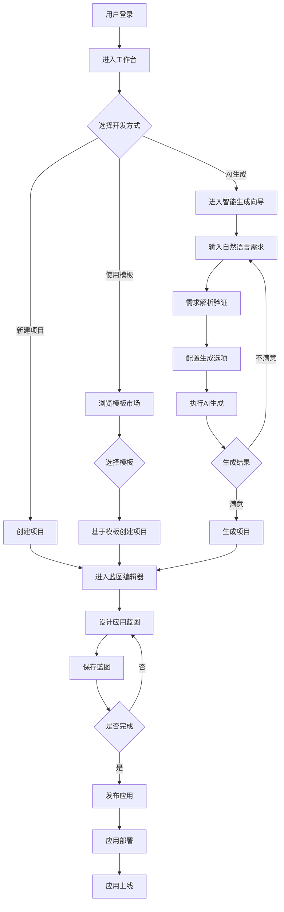
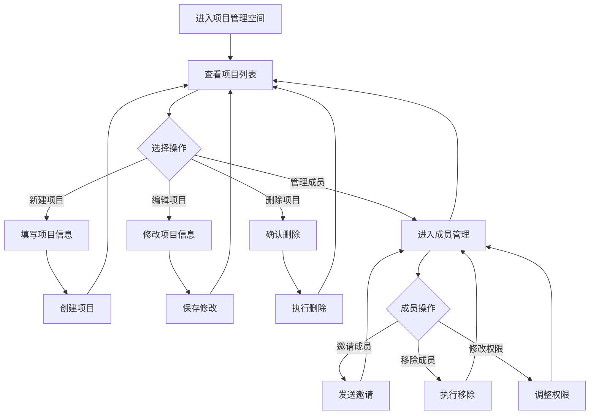
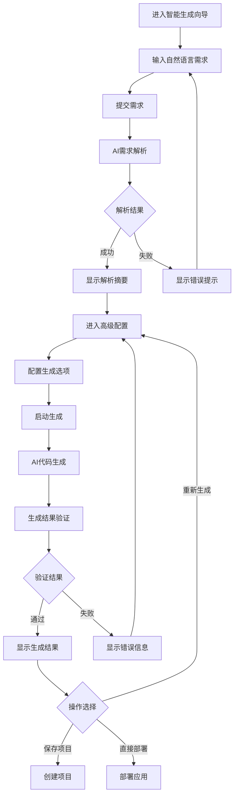
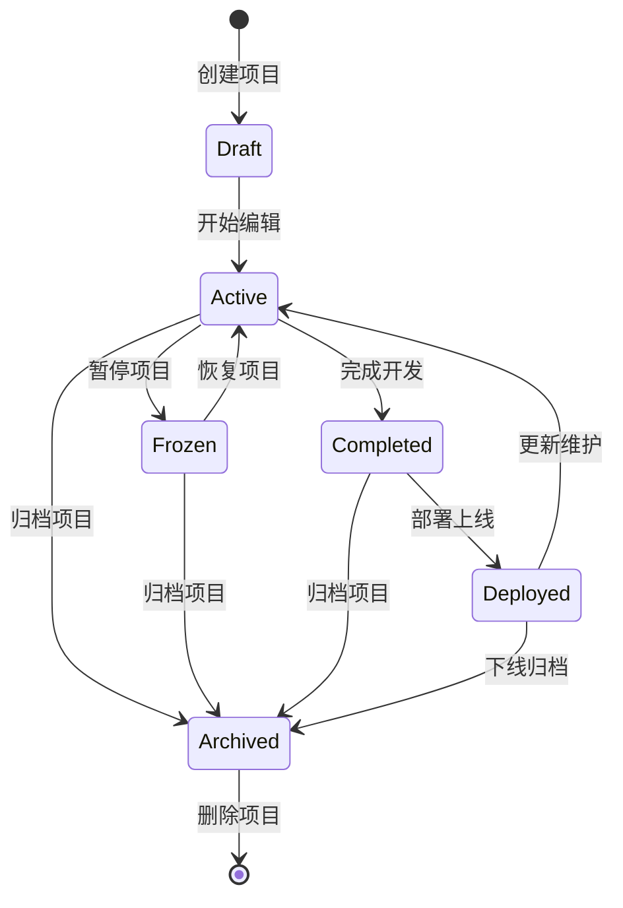
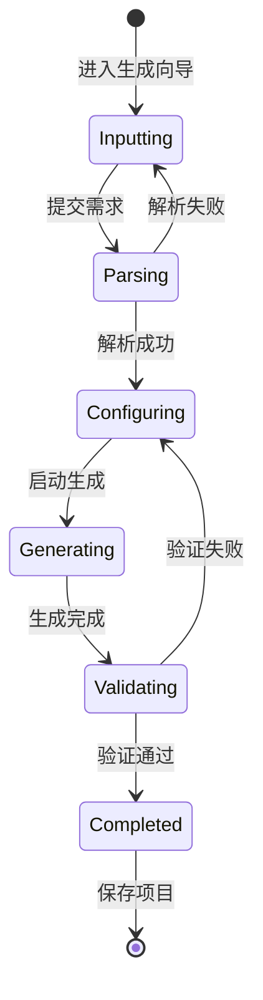

# 智码引擎业务流程图与规则文档

## 1. 核心业务流程图

### 1.1 应用开发完整流程

### 1.2 项目管理流程

### 1.3 AI生成流程

## 2. 关键业务规则

### 2.1 用户管理规则

1. **用户注册规则**：
   - 用户名长度：6-20个字符
   - 密码长度：8-20个字符，必须包含大小写字母、数字和特殊字符
   - 邮箱格式必须符合标准规范
   - 手机号码必须为11位有效数字

2. **用户登录规则**：
   - 支持邮箱/用户名/手机号登录
   - 连续5次登录失败后，账户锁定15分钟
   - 登录成功后自动刷新Token
   - 长时间无操作自动登出（默认30分钟）

### 2.2 项目管理规则

1. **项目创建规则**：
   - 项目名称长度：2-50个字符
   - 项目描述不超过500个字符
   - 每个用户创建的项目数量限制：免费版10个，高级版50个
   - 项目创建后默认私有，可设置为公开

2. **项目权限规则**：
   - 项目创建者默认拥有所有权限
   - 成员权限分为：管理员、编辑者、查看者
   - 管理员：可管理成员、修改项目设置、删除项目
   - 编辑者：可编辑项目内容、保存修改
   - 查看者：仅可查看项目内容，不可修改

### 2.3 蓝图设计规则

1. **蓝图组件规则**：
   - 每个蓝图至少包含一个页面组件
   - 组件必须符合平台定义的规范
   - 组件间数据传递必须通过明确的接口
   - 组件名称必须唯一

2. **蓝图版本规则**：
   - 每次保存自动创建新版本
   - 最多保留最近100个版本
   - 支持版本回滚
   - 版本更新必须记录修改人、修改时间和修改内容

### 2.4 AI生成规则

1. **需求输入规则**：
   - 自然语言需求长度：50-5000个字符
   - 支持中文、英文输入
   - 需求必须包含明确的功能描述
   - 不支持违法、违规内容

2. **生成结果规则**：
   - 生成的代码必须符合选定技术栈的规范
   - 生成的应用必须可以正常运行
   - 生成结果必须包含完整的文档
   - 同一需求每天生成次数限制：免费版5次，高级版20次

### 2.5 模板市场规则

1. **模板上传规则**：
   - 模板必须包含完整的应用结构
   - 模板必须附带详细的使用说明
   - 模板大小限制：100MB
   - 模板必须通过安全检测

2. **模板使用规则**：
   - 免费模板可直接使用
   - 付费模板需购买后使用
   - 模板使用必须遵守版权协议
   - 自定义模板仅本人可见，可设置为公开

## 3. 业务状态转换

### 3.1 项目状态转换

### 3.2 AI生成状态转换

## 4. 约束条件

1. **性能约束**：
   - 页面加载时间不超过2秒
   - 蓝图编辑器响应时间不超过500ms
   - AI生成时间不超过5分钟
   - 系统支持同时在线用户数：1000+（免费版），10000+（企业版）

2. **安全约束**：
   - 所有数据传输采用HTTPS加密
   - 用户密码采用SHA256加密存储
   - API接口必须进行身份验证和授权
   - 定期进行安全漏洞扫描
   - 敏感数据脱敏处理

3. **兼容性约束**：
   - 支持主流浏览器：Chrome、Firefox、Safari、Edge（最新3个版本）
   - 支持响应式设计，适配桌面、平板、手机
   - 后端API支持跨域请求
   - 数据库支持MySQL 5.7+、PostgreSQL 10+（可选）

4. **可用性约束**：
   - 系统可用性：99.9%（企业版），99.5%（免费版）
   - 数据备份：每日自动备份，保留30天
   - 故障恢复时间：核心功能≤1小时，非核心功能≤4小时
   - 提供详细的系统监控和日志

## 5. 风险点识别

1. **业务风险**：
   - 需求理解偏差：AI可能误解用户需求
   - 用户体验问题：复杂功能可能导致学习曲线陡峭
   - 市场竞争：同类产品较多，差异化不明显

2. **技术风险**：
   - AI生成质量：生成的代码可能存在质量问题
   - 系统性能：高并发下可能出现性能瓶颈
   - 数据安全：用户数据和生成的代码安全保护

3. **项目风险**：
   - 需求变更：频繁变更可能导致项目延期
   - 资源不足：开发资源不足可能影响项目进度
   - 技术选型：技术选择不当可能导致后期维护困难

## 6. 依赖关系说明

| 依赖项 | 类型 | 说明 |
|--------|------|------|
| 前端框架 | 技术依赖 | Vue 3 + TypeScript |
| UI组件库 | 技术依赖 | Element Plus |
| 后端框架 | 技术依赖 | FastAPI |
| 数据库 | 技术依赖 | MySQL |
| AI模型 | 技术依赖 | 大语言模型（如GPT-4、Claude等） |
| 云服务 | 外部依赖 | 用于应用部署和运行 |
| 第三方库 | 技术依赖 | 各种开发库和工具 |

## 7. 关键术语定义

| 术语 | 定义 |
|------|------|
| 智码引擎 | AI驱动的低代码开发平台 |
| 蓝图 | 应用的可视化设计模型，包含页面布局、数据模型和业务逻辑 |
| AI生成 | 使用人工智能技术自动生成应用代码 |
| 模板 | 预定义的应用结构，可作为新项目的基础 |
| 生成向导 | 引导用户完成AI生成流程的交互式界面 |
| 高级配置 | 精细控制AI生成过程的设置界面 |