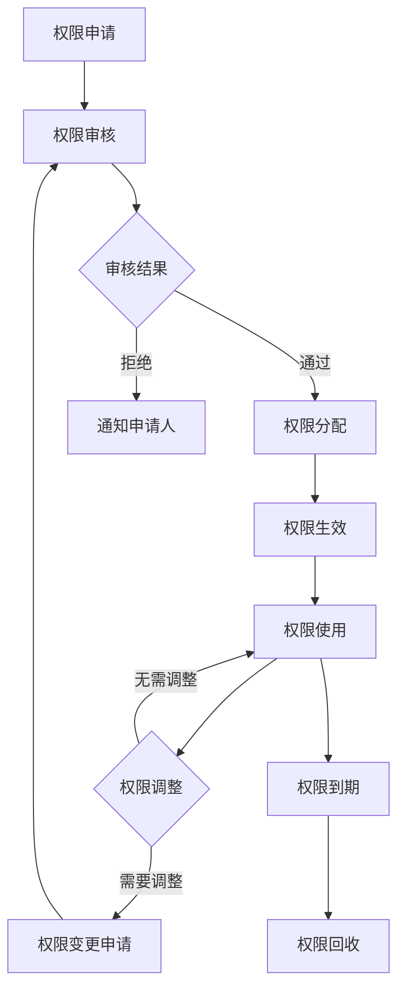

# 智码引擎角色权限矩阵

## 1. 角色定义

| 角色名称 | 角色描述 | 使用场景 |
|----------|----------|----------|
| 系统管理员 | 拥有系统最高权限，负责系统整体管理 | 平台运营和维护 |
| 项目管理员 | 负责特定项目的全面管理 | 项目负责人 |
| 开发人员 | 负责应用开发和维护 | 实际开发工作 |
| 普通用户 | 可以使用平台基本功能 | 一般用户 |
| 游客 | 未注册用户，仅能浏览部分内容 | 潜在用户 |

## 2. 权限矩阵

### 2.1 工作台模块权限

| 权限项 | 系统管理员 | 项目管理员 | 开发人员 | 普通用户 | 游客 |
|--------|------------|------------|----------|----------|------|
| 查看工作台 | ✅ | ✅ | ✅ | ✅ | ❌ |
| 快速创建项目 | ✅ | ✅ | ✅ | ✅ | ❌ |
| 访问最近项目 | ✅ | ✅ | ✅ | ✅ | ❌ |
| 查看通知中心 | ✅ | ✅ | ✅ | ✅ | ❌ |
| 访问快捷操作 | ✅ | ✅ | ✅ | ✅ | ❌ |
| 查看数据统计 | ✅ | ✅ | ✅ | ✅ | ❌ |
| 管理工作台设置 | ✅ | ❌ | ❌ | ❌ | ❌ |

### 2.2 项目管理空间模块权限

| 权限项 | 系统管理员 | 项目管理员 | 开发人员 | 普通用户 | 游客 |
|--------|------------|------------|----------|----------|------|
| 查看项目列表 | ✅ | ✅ | ✅ | ✅ | ❌ |
| 创建新项目 | ✅ | ✅ | ✅ | ✅ | ❌ |
| 编辑项目信息 | ✅ | ✅ | ❌ | ❌ | ❌ |
| 删除项目 | ✅ | ✅ | ❌ | ❌ | ❌ |
| 查看项目详情 | ✅ | ✅ | ✅ | ✅ | ❌ |
| 邀请项目成员 | ✅ | ✅ | ❌ | ❌ | ❌ |
| 移除项目成员 | ✅ | ✅ | ❌ | ❌ | ❌ |
| 修改成员权限 | ✅ | ✅ | ❌ | ❌ | ❌ |
| 管理项目资源 | ✅ | ✅ | ✅ | ❌ | ❌ |
| 管理项目版本 | ✅ | ✅ | ✅ | ❌ | ❌ |
| 查看所有项目 | ✅ | ❌ | ❌ | ❌ | ❌ |
| 删除所有项目 | ✅ | ❌ | ❌ | ❌ | ❌ |

### 2.3 蓝图编辑器模块权限

| 权限项 | 系统管理员 | 项目管理员 | 开发人员 | 普通用户 | 游客 |
|--------|------------|------------|----------|----------|------|
| 打开蓝图编辑器 | ✅ | ✅ | ✅ | ✅ | ❌ |
| 设计应用蓝图 | ✅ | ✅ | ✅ | ✅ | ❌ |
| 保存蓝图 | ✅ | ✅ | ✅ | ✅ | ❌ |
| 编辑现有蓝图 | ✅ | ✅ | ✅ | ❌ | ❌ |
| 删除蓝图 | ✅ | ✅ | ✅ | ❌ | ❌ |
| 导出蓝图 | ✅ | ✅ | ✅ | ✅ | ❌ |
| 导入蓝图 | ✅ | ✅ | ✅ | ✅ | ❌ |
| 查看蓝图历史版本 | ✅ | ✅ | ✅ | ❌ | ❌ |
| 回滚蓝图版本 | ✅ | ✅ | ✅ | ❌ | ❌ |
| 管理蓝图模板 | ✅ | ✅ | ❌ | ❌ | ❌ |

### 2.4 模板市场模块权限

| 权限项 | 系统管理员 | 项目管理员 | 开发人员 | 普通用户 | 游客 |
|--------|------------|------------|----------|----------|------|
| 浏览模板 | ✅ | ✅ | ✅ | ✅ | ✅ |
| 搜索模板 | ✅ | ✅ | ✅ | ✅ | ✅ |
| 查看模板详情 | ✅ | ✅ | ✅ | ✅ | ✅ |
| 下载免费模板 | ✅ | ✅ | ✅ | ✅ | ❌ |
| 购买付费模板 | ✅ | ✅ | ✅ | ✅ | ❌ |
| 评论模板 | ✅ | ✅ | ✅ | ✅ | ❌ |
| 评分模板 | ✅ | ✅ | ✅ | ✅ | ❌ |
| 上传自定义模板 | ✅ | ✅ | ✅ | ❌ | ❌ |
| 管理模板 | ✅ | ❌ | ❌ | ❌ | ❌ |
| 删除模板 | ✅ | ❌ | ❌ | ❌ | ❌ |
| 审核模板 | ✅ | ❌ | ❌ | ❌ | ❌ |

### 2.5 智能生成向导模块权限

| 权限项 | 系统管理员 | 项目管理员 | 开发人员 | 普通用户 | 游客 |
|--------|------------|------------|----------|----------|------|
| 进入生成向导 | ✅ | ✅ | ✅ | ✅ | ❌ |
| 输入自然语言需求 | ✅ | ✅ | ✅ | ✅ | ❌ |
| 提交需求 | ✅ | ✅ | ✅ | ✅ | ❌ |
| 查看解析结果 | ✅ | ✅ | ✅ | ✅ | ❌ |
| 配置生成选项 | ✅ | ✅ | ✅ | ✅ | ❌ |
| 执行AI生成 | ✅ | ✅ | ✅ | ✅ | ❌ |
| 查看生成结果 | ✅ | ✅ | ✅ | ✅ | ❌ |
| 保存生成项目 | ✅ | ✅ | ✅ | ✅ | ❌ |
| 管理生成历史 | ✅ | ✅ | ✅ | ✅ | ❌ |
| 设置生成限制 | ✅ | ❌ | ❌ | ❌ | ❌ |

### 2.6 高级生成配置模块权限

| 权限项 | 系统管理员 | 项目管理员 | 开发人员 | 普通用户 | 游客 |
|--------|------------|------------|----------|----------|------|
| 进入高级配置 | ✅ | ✅ | ✅ | ✅ | ❌ |
| 选择技术栈 | ✅ | ✅ | ✅ | ✅ | ❌ |
| 配置代码风格 | ✅ | ✅ | ✅ | ✅ | ❌ |
| 定义生成规则 | ✅ | ✅ | ✅ | ❌ | ❌ |
| 管理依赖 | ✅ | ✅ | ✅ | ❌ | ❌ |
| 设置高级选项 | ✅ | ✅ | ✅ | ❌ | ❌ |
| 保存配置模板 | ✅ | ✅ | ✅ | ❌ | ❌ |
| 管理全局配置 | ✅ | ❌ | ❌ | ❌ | ❌ |

### 2.7 帮助中心模块权限

| 权限项 | 系统管理员 | 项目管理员 | 开发人员 | 普通用户 | 游客 |
|--------|------------|------------|----------|----------|------|
| 浏览帮助文档 | ✅ | ✅ | ✅ | ✅ | ✅ |
| 搜索帮助内容 | ✅ | ✅ | ✅ | ✅ | ✅ |
| 查看FAQ | ✅ | ✅ | ✅ | ✅ | ✅ |
| 观看视频教程 | ✅ | ✅ | ✅ | ✅ | ✅ |
| 提交反馈 | ✅ | ✅ | ✅ | ✅ | ❌ |
| 联系支持 | ✅ | ✅ | ✅ | ✅ | ❌ |
| 管理帮助内容 | ✅ | ❌ | ❌ | ❌ | ❌ |

### 2.8 用户管理模块权限

| 权限项 | 系统管理员 | 项目管理员 | 开发人员 | 普通用户 | 游客 |
|--------|------------|------------|----------|----------|------|
| 查看用户列表 | ✅ | ❌ | ❌ | ❌ | ❌ |
| 创建用户 | ✅ | ❌ | ❌ | ❌ | ❌ |
| 编辑用户信息 | ✅ | ❌ | ❌ | ✅ | ❌ |
| 删除用户 | ✅ | ❌ | ❌ | ❌ | ❌ |
| 查看用户详情 | ✅ | ❌ | ❌ | ✅ | ❌ |
| 修改用户密码 | ✅ | ❌ | ❌ | ✅ | ❌ |
| 管理用户角色 | ✅ | ❌ | ❌ | ❌ | ❌ |
| 禁用/启用用户 | ✅ | ❌ | ❌ | ❌ | ❌ |

### 2.9 团队管理模块权限

| 权限项 | 系统管理员 | 项目管理员 | 开发人员 | 普通用户 | 游客 |
|--------|------------|------------|----------|----------|------|
| 创建团队 | ✅ | ✅ | ✅ | ❌ | ❌ |
| 查看团队列表 | ✅ | ✅ | ✅ | ❌ | ❌ |
| 编辑团队信息 | ✅ | ✅ | ❌ | ❌ | ❌ |
| 删除团队 | ✅ | ✅ | ❌ | ❌ | ❌ |
| 邀请团队成员 | ✅ | ✅ | ✅ | ❌ | ❌ |
| 移除团队成员 | ✅ | ✅ | ❌ | ❌ | ❌ |
| 修改成员角色 | ✅ | ✅ | ❌ | ❌ | ❌ |
| 管理团队项目 | ✅ | ✅ | ❌ | ❌ | ❌ |

### 2.10 系统设置模块权限

| 权限项 | 系统管理员 | 项目管理员 | 开发人员 | 普通用户 | 游客 |
|--------|------------|------------|----------|----------|------|
| 进入系统设置 | ✅ | ❌ | ❌ | ❌ | ❌ |
| 配置系统参数 | ✅ | ❌ | ❌ | ❌ | ❌ |
| 管理系统日志 | ✅ | ❌ | ❌ | ❌ | ❌ |
| 设置安全规则 | ✅ | ❌ | ❌ | ❌ | ❌ |
| 管理AI模型 | ✅ | ❌ | ❌ | ❌ | ❌ |
| 配置邮件服务 | ✅ | ❌ | ❌ | ❌ | ❌ |
| 查看系统信息 | ✅ | ❌ | ❌ | ❌ | ❌ |

## 3. 权限分配和管理机制

### 3.1 权限分配原则

1. **最小权限原则**：用户只能获得完成工作所需的最小权限集合
2. **职责分离原则**：不同职责的权限应分配给不同用户
3. **权限继承原则**：高级角色自动继承低级角色的所有权限
4. **动态调整原则**：权限应根据用户职责变化及时调整

### 3.2 权限管理流程

### 3.3 权限验证机制

1. **基于角色的访问控制（RBAC）**：系统采用RBAC模型进行权限管理
2. **多层验证**：在UI层、API层和数据层都进行权限验证
3. **会话管理**：使用Token进行身份验证，定期更新Token
4. **审计日志**：记录所有权限相关操作，便于追踪和审计

## 4. 角色升级路径

| 当前角色 | 升级条件 | 目标角色 |
|----------|----------|----------|
| 普通用户 | 完成实名认证，使用平台30天以上 | 开发人员 |
| 开发人员 | 创建5个以上项目，参与2个以上团队 | 项目管理员 |
| 项目管理员 | 管理10个以上项目，系统评分4.5以上 | 系统管理员（邀请制） |

## 5. 特殊权限说明

### 5.1 临时权限

- 系统支持为用户分配临时权限
- 临时权限有明确的有效期
- 到期后自动回收
- 适用于临时需要某些权限的场景

### 5.2 批量权限

- 支持批量为多个用户分配相同权限
- 支持批量回收权限
- 提高权限管理效率

### 5.3 权限模板

- 系统提供预定义的权限模板
- 可以基于模板快速分配权限
- 支持自定义权限模板

## 6. 权限审计

1. **审计内容**：
   - 权限分配记录
   - 权限使用记录
   - 权限变更记录
   - 权限违规记录

2. **审计周期**：
   - 定期审计（每月一次）
   - 事件触发审计（如权限变更时）
   - 随机审计（不定期抽查）

3. **审计报告**：
   - 生成详细的审计报告
   - 包含权限使用统计和异常分析
   - 提交给系统管理员和相关负责人

## 7. 权限常见问题

| 问题 | 解决方案 |
|------|----------|
| 用户忘记密码 | 使用密码重置功能 |
| 用户权限不足 | 申请相应权限或联系管理员 |
| 权限错误分配 | 及时回收错误权限并重新分配 |
| 权限冲突 | 调整权限配置，确保职责分离 |
| 权限泄露 | 立即回收权限，调查原因并修复漏洞 |

## 8. 版本控制

| 版本 | 更新日期 | 更新内容 | 更新人 |
|------|----------|----------|--------|
| v1.0 | 2025-12-16 | 初始版本 | 系统管理员 |